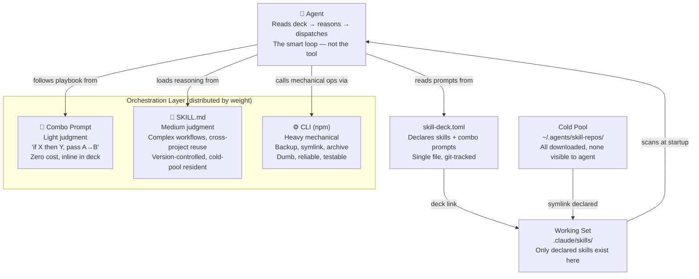

# lythoskill

> **Declarative skill governance AND orchestration for AI agent teams.** Declare which skills a project needs in `skill-deck.toml`. Combo prompts tell the agent how to orchestrate them. `deck link` reconciles the working set — undeclared skills are physically absent from the agent's view. The deck is the orchestrator: skill manifest + playbook + isolation discipline, all in one file. Built and self-governed by AI agents — see [how we govern this project](#ecosystem-tools).

[](https://www.npmjs.com/package/@lythos/skill-deck)
[](https://github.com/lythos-labs/lythoskill/actions/workflows/test.yml)
[](https://bun.sh)
[](https://www.typescriptlang.org)
[](https://nodejs.org/api/esm.html)
[](https://opensource.org/licenses/MIT)
[](https://deepwiki.com/lythos-labs/lythoskill)

**🌐 Languages:** [中文](./README.zh.md)

---

## What problem does this solve?

When two skills both describe how to write tests, your agent gets conflicting instructions. "Disabling" a skill doesn't remove it — the agent can still see it. And when something goes wrong, you can't tell which skill caused it without removing them one by one. **lythoskill enforces deny-by-default**: undeclared skills are absent from the working set. If a conflict surfaces, bisect your `skill-deck.toml` — the lockfile tells you exactly what was loaded.

| | `npx skills add` | lythoskill `deck link` |
|---|---|---|
| Install | `npx skills add <repo>` — imperative | Declare in `skill-deck.toml` — declarative |
| After install | Skill stays in scan path until `remove` | `deck link` reconciles — undeclared skills absent from working set |
| Multi-platform | `-a claude-code` / `-a cursor` per install | One TOML, configure `working_set` per platform |
| Discover | `npx skills find` → skills.sh directory | Curator scans local cold pool; agent uses WebSearch for discovery |
| Share | `skills-lock.json` | `skill-deck.lock` |

| Skills | State | Action |
|--------|-------|--------|
| 0–3, no conflicts | Simple | **deck** works, but manual management is fine too. |
| 5–10, some conflicts | Growing | Use **deck** — declare which skills this project needs. |
| 10+, you author skills | Ecosystem | Use **deck + creator** — thin-skill pattern. |
| Managing across teams/projects | Ecosystem | Full lythoskill: deck + creator + curator + arena. |

`skill-deck.lock` gives you a single source of truth for "what skills were active when this was built." Commit it. Teammates get identical working sets. CI is reproducible. When something breaks, bisect the toml — the lockfile tells you exactly what changed.

---

<details>
<summary>🤖 For Agents</summary>

If you are an AI agent reading this README:

1. Check `bun --version` — if missing, install Bun
2. Run `bunx @lythos/skill-deck@latest link --deck <url|path>` to activate the project's deck
3. Skills load from the `working_set` directory in `skill-deck.toml`

Agents use lythoskill to build real things. [`showcase/`](./showcase/) contains pages, reports, and tools built by agents using lythoskill-governed decks.

</details>

---

## Quick Start

### Give this to your agent

Copy the block below. Tell your agent: "Set up lythoskill for this project." The agent reads, installs Bun if needed, creates a deck, runs `deck link`, and verifies.

````
Read https://raw.githubusercontent.com/lythos-labs/lythoskill/main/README.md.
1. Check `bun --version` — if missing, install Bun.
2. Pick a skill from skills.sh or anthropics/skills.
3. Create `skill-deck.toml`:
   ```toml
   [deck]
   max_cards = 10
   [tool.skills.frontend-design]
   path = "github.com/anthropics/skills/skills/frontend-design"
   ```
   Then run `bunx @lythos/skill-deck@latest link`.
4. Verify skills appeared in your working_set directory.
````

That's the agent-era quick start: tell your agent, not your terminal.

### Or run it yourself

```bash
curl -fsSL https://raw.githubusercontent.com/lythos-labs/lythoskill/main/examples/quick-init.sh | bash
```

The script installs Bun, creates a `skill-deck.toml` with `frontend-design` (Anthropic's official design skill), runs `deck link`, and self-checks. One command, a skill appears, done.

It's the same feeling as `npm install` — declared manifest, one command, reproducible result on disk. The difference from `npx skills add`: `deck link` is declarative (like `package.json`), not imperative (like `brew install`).

To add more: `curl ... | bash -s -- --skill github.com/owner/repo/path`. Or edit `skill-deck.toml` and re-run `bunx @lythos/skill-deck@latest link`.

### Manual setup

```bash
# 1. Create your deck
cat > skill-deck.toml << 'EOF'
[deck]
max_cards = 3
cold_pool = "~/.agents/skill-repos"

[tool.skills.frontend-design]
path = "github.com/anthropics/skills/skills/frontend-design"
EOF

# 2. Link
bunx @lythos/skill-deck@latest link
```

This uses Anthropic's official [`frontend-design`](https://github.com/anthropics/skills/tree/main/skills/frontend-design) skill — a real, runnable example. After linking, check `.claude/skills/` (or your configured `working_set`) and you'll see the skill files on disk. See [`examples/decks/INDEX.md`](./examples/decks/INDEX.md) for 18+ pre-built decks.

### Managing Your Deck

**Add a skill** — supports skills.sh syntax (`owner/repo`), FQ locators, or `@skill` filters:
```bash
bunx @lythos/skill-deck@latest add vercel-labs/agent-skills
bunx @lythos/skill-deck@latest add github.com/anthropics/skills/skills/frontend-design
```

**Remove a skill** — from deck and working set (cold pool untouched):
```bash
bunx @lythos/skill-deck@latest remove <alias>
```

**Refresh skills** — scan for upstream updates (plan-only by default; add `--exec` to pull):
```bash
bunx @lythos/skill-deck@latest refresh           # plan-only
bunx @lythos/skill-deck@latest refresh tdd --exec # pull a single skill
```

**Validate deck** — check TOML schema before committing:
```bash
bunx @lythos/skill-deck@latest validate
```

`skill-deck.lock` tracks the resolved working set. Commit it so teammates get identical links.

---

## skill-deck.toml Reference

| Section | Key | Required | Default | Description |
|---------|-----|----------|---------|-------------|
| `[deck]` | `max_cards` | No | `10` | Max skills active in the working set |
| `[deck]` | `cold_pool` | No | `~/.agents/skill-repos` | Root directory for cloned skill repos |
| `[deck]` | `working_set` | No | `.claude/skills` | Directory where symlinks are created |
| `[innate]` | `skills.<name>.path` | Yes* | — | Always loaded; agent cannot override |
| `[tool]` | `skills.<name>.path` | Yes* | — | Available for agent to invoke |
| `[transient]` | `skills.<name>.path` | Yes* | — | Time-bounded skills (auto-expire) |

\* Required when that section is used.

**Skill types:**

| Type | Behavior | Counts against max_cards? |
|------|----------|---------------------------|
| **`[innate]`** | Eager — loaded at session start, agent cannot remove | Yes |
| **`[tool]`** | Lazy — agent invokes on demand (default) | Yes |
| **`[transient]`** | Lazy + expiry — auto-expires past due date | Yes |

---

## How it works

A **deck** is both a **declarative skill manifest** and an **orchestrator** — a `skill-deck.toml` file that names which skills are active AND tells the agent how to combine them. Combo prompts describe orchestration in natural language ("if X then Y, pass A's output to B"). The deck is the agent's playbook.

### Why "deck = orchestrator" is not a buzzword



> **The orchestrator is not a separate component.** It's distributed by weight: light judgment stays in combo prompts (inline in the deck), medium judgment sinks to SKILL.md (versioned, reusable), heavy mechanical work sinks to CLI npm (dumb, reliable). The agent is the reasoning engine — the deck is the playbook.
>
> **The deck delegates determinism to the CLI.** Prompts describe intent; the CLI enforces guarantees. "Refuse if `working_set` is `~`" — that can't be a prompt instruction, it must be a hard gate. "Back up 100MB before removing" — that's a `tar` command, not something the agent should remember. The deck makes the design decision: **deterministic constraints → CLI (npm, tested). Judgment calls → SKILL.md (agent reasons). Light glue → combo prompt (inline, zero cost).** The weight decides the layer.

**See it in action:**
- [Seed bootstrap](./showcase/2026-05-17-vanilla-seed-bootstrap/): Agent starts with 1 skill (`lythoskill-deck`) and self-expands to 5 — reads deck SKILL.md, understands the architecture, adds skills, self-heals network errors
- [Combo orchestration](./showcase/2026-05-13-deep-research-baoyu-combo/): 6 skills from 2 unrelated repos composed into a single research→HTML pipeline — orchestration lives in the deck structure, not external code

The design stays true to four principles: **declarative** (manifest, not imperative add/remove), **multi-platform** (one TOML, any agent), **deny-by-default** (undeclared = absent), **local-first** (git cache, no central server).

```
Sources (GitHub, localhost, etc.)
    │
    ▼ git clone / git pull
Cold Pool  (~/.agents/skill-repos/)
    │          github.com/lythos-labs/lythoskill/skills/lythoskill-deck/
    │          github.com/mattpocock/skills/skills/engineering/tdd/
    │          localhost/me/sober/
    │
    ▼ symlink (only declared skills)
Working Set (.claude/skills/ or .kimi/skills/ or .cursor/skills/ etc.)
    │
    ▼ agent startup scan
Agent sees only declared skills. No more. No less.
```

Skills live in a **cold pool** — a local git cache at `~/.agents/skill-repos/`, organized like Go modules (`github.com/owner/repo`). No central registry. No auth server. No daemon.

`deck link` writes a **lockfile** (`skill-deck.lock`) that pins each skill. Commit it — teammates get the exact same links.

Skills are authored using the **thin-skill pattern**: heavy logic in npm packages, agent-facing instructions in lightweight SKILL.md files ([details](./AGENTS.md)).

### Explore Pre-Built Decks

18+ decks for common tasks: documentation, research, architecture review, security audit. See [`examples/decks/INDEX.md`](./examples/decks/INDEX.md).

---

## Why Trust This

We are in early days. No Fortune 500 testimonial yet. What we have is **self-governance transparency**:

- **Every decision is an ADR.** Browse [`cortex/adr/02-accepted/`](./cortex/adr/02-accepted/) — 30+ architecture decisions with full reasoning, rejected alternatives, and confidence scores. No "trust us, we know better."
- **Every release is arena-tested.** Before a skill ships, it runs through controlled-variable comparisons against real tasks. See [`showcase/`](./showcase/) for pages, reports, and tools built by agents using lythoskill-governed decks.
- **Every skill is built with creator.** The thin-skill pattern (`packages/<name>/skill/SKILL.md`) means agent-facing instructions are separate from implementation — you can audit exactly what the agent sees.
- **1000+ tests, 0 fail.** Unit + CLI BDD + agent BDD layers across 56 test files. Coverage is honest — no gate inflation.

This project is its own proof. We govern it with the same tools we ship.

---

## Naming Cheat Sheet

```
lythoskill           ← the project / ecosystem
skill-deck.toml      ← the config file you edit
@lythos/skill-deck   ← the npm package
deck                 ← the CLI command
link                 ← subcommand: reconcile working set to toml
```

---

## Ecosystem Tools

| Tool | npm | What it means for you |
|------|-----|----------------------|
| **deck** | [`@lythos/skill-deck`](https://www.npmjs.com/package/@lythos/skill-deck) | One file declares what skills are active. Teammates get identical setups. CI is reproducible. |
| **creator** | [`@lythos/skill-creator`](https://www.npmjs.com/package/@lythos/skill-creator) | Build skills that are light for agents but maintainable for humans. No more 5,000-line SKILL.md files. |
| **curator** | [`@lythos/skill-curator`](https://www.npmjs.com/package/@lythos/skill-curator) | Stop hoarding skills you forgot why you installed. Query by niche: "what testing skills do I have?" |
| **arena** | [`@lythos/skill-arena`](https://www.npmjs.com/package/@lythos/skill-arena) | Prove a skill works before you adopt it. No more "works on my machine" — controlled comparison with evidence. |
| **coach** | [`@lythos/skill-coach`](https://www.npmjs.com/package/@lythos/skill-coach) | Catch skill quality issues before they reach your agent. Like a linter, but for agent instructions. |
| **cortex** | [`@lythos/project-cortex`](https://www.npmjs.com/package/@lythos/project-cortex) | GTD-style project governance: every decision is an ADR, every task is tracked, nothing falls through cracks. |

We govern this project with our own tools. Every skill in `packages/` is built with creator. Every decision goes through cortex ADRs. Every release uses deck to manage working sets.

---

## Curator: Index Your Cold Pool

As your skill collection grows, you lose track of what you have and **why**. Curator scans your cold pool, extracts metadata from every SKILL.md, and builds a searchable index.

```bash
# Index your cold pool
bunx @lythos/skill-curator@latest ~/.agents/skill-repos

# Add a skill with a decision record
bunx @lythos/skill-curator@latest add github.com/foo/bar \
  --pool ~/.agents/skill-repos \
  --reason "Agent recommended, covers PDF extraction"

# Query by niche or keyword
bunx @lythos/skill-curator@latest query \
  "SELECT name, description FROM skills WHERE niches LIKE '%testing%'"
```

Curator provides the data; Arena provides the comparison. See [`packages/lythoskill-curator/README.md`](./packages/lythoskill-curator/README.md) for full documentation.

---

## Real-World Example: Deck-Governed Next.js Project

See [`examples/`](./examples/) for a complete walkthrough of a deck-governed Next.js project: writing a rich-text editor, adding a PDF report generator, switching skills mid-development, and running an arena cross-review. The agent orchestrates skill composition autonomously — the deck provides the governance layer.

---

## Arena: A/B Test Skill Configurations

Arena isolates skills in `/tmp` worktrees and spawns independent agents to execute the same task.

**Test a single deck:**
```bash
bunx @lythos/skill-arena@latest single \
  --deck ./examples/decks/scout.toml \
  --brief "Generate auth flow diagram" \
  --out ./output
```

**Compare two decks (agent-orchestrated, default):**
```bash
bunx @lythos/skill-arena@latest vs --config ./arena.toml
```

**Test with a specific player (cross-player):**
```bash
bunx @lythos/skill-arena@latest single \
  --deck ./deck.toml --brief "task" --player kimi
```

Cross-player requires installing the target agent CLI (e.g. `uv tool install kimi-cli`, `npm i -g @openai/codex`). In `vs` mode, each side's player is declared in `arena.toml` — not via `--player`. See [`packages/lythoskill-arena/skill/SKILL.md`](./packages/lythoskill-arena/skill/SKILL.md) for the full protocol. See [`references/comparisons.md`](./references/comparisons.md) for how this compares to benchmark suites.

---

## Cold Pool Convention

```
~/.agents/skill-repos/
  github.com/
    lythos-labs/lythoskill/skills/lythoskill-deck/
    mattpocock/skills/skills/engineering/tdd/
  localhost/              ← your own skills, not yet shared
    me/sober/
    me/my-project-skill/
```

No central registry. Just git repos in a directory tree. The convention makes skills addressable by path — `github.com/owner/repo` maps to `~/.agents/skill-repos/github.com/owner/repo`.

---

## Architecture

```
Starter (packages/<name>/)       → npm publish → implementation + CLI
Skill   (packages/<name>/skill/) → build → SKILL.md + thin scripts
Output  (skills/<name>/)         → committed → agent-visible skill
```

Three-layer separation: heavy logic lives in npm packages (Starter), agent-facing instructions live in lightweight SKILL.md files (Skill), and the agent sees only the output (committed symlinks).

See [`references/comparisons.md`](./references/comparisons.md) for how this compares to npm, Maven, and Kubernetes RBAC.

---

## Testing

```bash
bun --filter='*' run test          # all 1000+ tests (canonical gate)
bun run test:coverage              # coverage report
bun run test:bdd                   # BDD integration tests
```

---

## Troubleshooting

| Symptom | Fix |
|---------|-----|
| `Command not found: deck` | Use `bunx @lythos/skill-deck@latest <subcommand>` |
| `bun: command not found` | Install Bun: `curl -fsSL https://bun.sh/install | bash` |
| `bunx: command not found` after install | Restart shell or run `source ~/.bashrc` |
| `Skill not found` after `deck link` | Skill missing from cold pool: `bunx @lythos/skill-deck@latest add github.com/<owner>/<repo>` |
| Skill not visible to agent | Check `working_set` matches your agent's path (see below) |
| Symlink creation fails | Ensure `working_set` directory exists and is writable |
| `deck link` hangs or fails | `github.com` may be unreachable; see Environment Variables below |
| Lockfile merge conflict | Run `deck link` — lockfile is fully derived from `skill-deck.toml` |

**Environment Variables:**

| Variable | Purpose | Example |
|----------|---------|---------|
| `LYTHOS_GH_MIRROR` | GitHub mirror for restricted networks | `export LYTHOS_GH_MIRROR="https://mirror.example.com"` |
| `LYTHOS_SOCKS_PROXY` | SOCKS5 proxy for git/fetch operations | `export LYTHOS_SOCKS_PROXY="127.0.0.1:1080"` |
| `LYTHOS_GIT_PROTOCOL` | Git clone protocol (`https` or `ssh`) | `export LYTHOS_GIT_PROTOCOL="ssh"` |

`LYTHOS_GH_MIRROR` rewrites `github.com` URLs to your mirror — the tool does not auto-fallback to third-party mirrors (trust boundary stays with you). `LYTHOS_SOCKS_PROXY` routes connectivity probes through `curl --proxy socks5://`. `LYTHOS_GIT_PROTOCOL` changes the scheme in clone URLs (default is `https`).

**Agent `working_set` paths:**
- `.claude/skills/` — Claude Code
- `.agents/skills/` — Codex CLI, OpenClaw
- `.cursor/skills/` — Cursor
- `.kimi/skills/` — Kimi
- `.windsurf/skills/` — Windsurf
- `.github/skills/` — GitHub Copilot

---

## License

MIT — see [LICENSE](./LICENSE) for details.
