# ADR-20260518123403810: Curator role re-derivation: from rigid indexer to agent-assisted discovery companion

## Status History
<!-- machine-parseable table: directory = current status, last row = latest record -->

| Status | Date | Note |
|--------|------|------|
| proposed | 2026-05-18 | Created |
| accepted | 2026-05-18 | Accepted |

## 背景

### 第一性：Curator = 策展者/买家秀 = Remember

Curator 的本质是**记住**（remember）。技能良莠不齐，最佳找技能方式是什么？怎么确保 QA 没问题？底线是**自己动手丰衣足食**（arena 自测），但 trust network + cache 能省成本、加速度。

Curator 的核心隐喻不是"搜索引擎"，而是**策展者**——博物馆 curator（策展人）挑选、注释、组织展品，展品标签是 curator 写的，不是艺术家自己写的。策展人记住每件藏品的真伪鉴定结果、来源、与其他藏品的关联。

**卡牌游戏视角**（更直观）：skill = 卡牌，deck = 你的卡组，curator = **查卡器 + 备注 + 组卡审美**。
- **查卡器**：你的牌库（冷池）里有几百张牌，快速检索"有没有能做 X 的牌"——curator query
- **备注**：你在牌上写个人笔记——"这张看起来强但实战不行"、"适合 X 不适合 Y"——curator tag。这是你的备注，不是印在牌面上的厂商说明
- **组卡审美**：策展者一定在管理"skill 如何组合是美的"——哪些技能配合好、什么 archetype 需要什么角色、预组卡组是策展人审美的输出。这不是单卡数据，是**组合知识**
- **新牌发现** = agent + search（去卡店逛 / 看新发售）——这不是查卡器的活
- **全网技能 = DIY 卡牌**：这个卡片游戏支持各种 DIY——任何人都能发布技能，没有中央权威认证"真牌"。curator 不做 gatekeeping，**都能收纳进来玩**——但策展人的备注（L3）告诉你哪些 DIY 值得用
- **参考实现 — YGOPro**：开源游戏王模拟器。全卡收录（官方+DIY）→ 卡查/筛选 → 组卡 → 保存/分享卡组 → 回放验证。curator 就是这个卡查 + 组卡编辑器 + 卡组分享层。arena 是回放验证层

三层信任模型（project_curator_three_layer_trust.md）已确立：
- **L1 卖家秀** = skill author 的 description —— 有动机 pushy，未必准确（lythoskill 自己也是）
- **L2 测评** = Big V/hub 的推荐 —— 第三方信号，参考但不盲从
- **L3 买家秀** = curator 的个人标注 —— **最终激活权威**

从这个第一性出发，curator 的每个设计问题都有答案：
- **Niche 谁填？** → 策展人（agent 辅助），不是 skill author。author 的自我分类是牌面上的厂商说明（L1 卖家秀），策展人的分类是个人备注（L3 买家秀）
- **Curator 的数据是什么？** → 冷池 SKILL.md frontmatter（牌面印刷） + curator 个人标注（手写备注）
- **Curator 在动线中的角色？** → 查卡 + 备注。发现新牌是 agent+search 的事

组卡的标准动线是：**explore（发现）→ add（收录）→ link（激活）→ use（使用）→ arena（验证）**。

其中 **explore slot 的主力是 agent + search**（WebSearch、WebFetch、gh CLI、find-skill 等技能组合）。这已经是事实——agent 的语义理解 + 实时网络搜索远胜任何本地索引。curator 如果试图在这个 slot 里做 discovery engine，只会成为干扰。

### Curator 的价值 = 本地缓存

curator 唯一不可替代的价值是**本地缓存**：冷池在本地文件系统，curator 扫描一次写入 SQLite，后续查询不需要重新遍历文件系统。这是 agent+search 做不到的——agent 不能高效地 "grep 本地 200 个 repo 的所有 SKILL.md"。

但如果 curator 连这个缓存角色都做不好（字段 schema mismatch 导致 false negative、legacy 残留导致噪音、audit 误报导致干扰），它就是鸡肋——既不如直接 `find . -name SKILL.md | xargs head -20`，也不如 agent 的语义搜索。

### 具体阻抗匹配问题

1. **自定义扩展字段的干扰**：`deck_niche` 是 lythoskill 特有的 frontmatter 字段。Ecosystem 调研（wiki/02-research/2026-05-08-agentskill-sh-ecosystem-deep-dive.md）确认：主流生态只收敛到 2 个必填字段（`name` + `description`），其余 19 个字段均为平台侧运行时 enrichment。curator 以自定义字段为索引键，对主流技能产生 false negative。**字段本身有意义——agent 收录时帮忙打 tag——但作为 SKILL.md 提取键是错的。**

2. **Feed adapter 已证伪**：ADR-20260508230803515 确认 curator 不做外部 API 适配。发现属于 agent 层。但 curator 的 SKILL.md 查询示例仍暗示它是发现入口，与实际使用模式脱节。

3. **Legacy 残留**：`skills.sh` 引用、`deck status sh` 等历史残留。EPIC-20260518024809887 已关闭，BDD 切换到 reproduce.sh IoC 模式——curator 需要跟进。

4. **Agent 编排是默认，useAgent 有硬边界**：explore 阶段默认走 agent 编排。`useAgent`（agent-adapter/runner）保留给 cross-player 对比场景——Agent tool 只能 spawn 同类 agent，kimi vs codex 必须走 CLI runner。这个边界需在 curator 架构中明确。

核心矛盾：**curator 试图做 discovery engine（智能、语义），但 explore slot 已被 agent+search 占据。curator 应该退到本地缓存（机械、快速、schema 匹配现实），让 agent 在缓存之上做智能发现。**

## 决策驱动

- **阻抗匹配**：组卡时 curator 经常出 bug。本质是 curator 试图在 explore slot 里做 discovery engine，但 explore 的主力是 agent+search。curator 如果不退到本地缓存角色，就是干扰。
- **Deck/arena 已定型**：deck 的 add/link/refresh 和 arena 的 single/vs/compare 已稳定。curator 是最后一个需要对齐的组件。
- **Ecosystem 现实**：wiki 调研确认主流生态只收敛到 `name` + `description` 两个必填字段。agentskill.sh 的 19 个字段全是平台侧运行时 enrichment，无一是 skill author 填写的。curator 的 schema 必须匹配这个现实——sidecar metadata 模式（agent-enriched，与 SKILL.md 分离）。
- **Curator 的使用动线角色**：不是 explore slot 的主力（agent+search 占据），而是 **pre-explore 的本地缓存**（快速知道冷池有什么）+ **post-explore 的 enrichment 层**（agent 收录后打 tag，下次更快）。

## 选项

### 方案 A：Curator 继续做 discovery engine（现状强化）

保持 curator 作为主要发现入口的定位，强化 SQLite 查询能力，添加 FTS5 全文索引，扩展自定义字段体系。

**优点**:
- 不改变现有架构，增量改进
- SQLite FTS5 能提供比 LIKE 更好的文本搜索

**缺点**:
- 自定义字段体系与主流生态永远不兼容（不管我们加多少字段，主流技能不会填）
- SQLite 永远不是向量数据库——语义匹配天花板很低
- Feed adapter 已被证伪，curator 的数据源只有冷池 SKILL.md frontmatter——字段再多也是空的
- 与 thin pattern 冲突：intelligence 被锁在 SQL 查询里，而非 agent 可调整的 SKILL.md 指令

### 方案 B：Curator 退到纯 indexer + agent 负责 discovery

Curator 只做机械性的工作：扫描冷池 → 标准化 frontmatter → 写入 SQLite/REGISTRY.json。不再提供 niche/keyword 查询作为主要发现手段。发现 SOP 完全在 SKILL.md 中描述（agent 用 WebSearch + gh + find-skill + curator 的原始索引）。

**优点**:
- 消除阻抗匹配——curator 不再对主流技能施加 lythoskill 特定的 schema 要求
- 与 thin pattern 一致——intelligence 在 SKILL.md，CLI 是 mechanical glue
- 与已证伪的 feed adapter 决策一致
- 简化代码：去掉 niche 提取、audit 空 niche 检查、REGISTRY.json 的 byNiche 索引

**缺点**:
- 失去结构化的 niche 分类——但主流技能本来就没有，所以失去的是"我们以为有用的东西"
- agent 做 discovery 的质量依赖 prompt 质量——但 arena 可以验证

### 方案 C：Agent-enriched metadata（curator scan + agent tag）

Curator 扫描冷池时不要求 niche，但提供 **agent 可写入的 metadata 层**——agent 在收录技能时通过 curator 的 `tag` 子命令写入推断的 niche/tags。索引结构保留，但 niche 是 agent-assigned 而非 skill-author-declared。

**优点**:
- niche 字段不死——agent 收录时帮忙打 tag，积累真实的分类数据
- curator 的 schema 不需要主流技能配合——字段是 agent 填充的，不是从 SKILL.md 提取的
- agent-enriched metadata 可以跨 session 累积，形成个人化的分类体系

**缺点**:
- 增加了 curator 的写路径（tag 子命令）
- agent-enriched 的 niche 质量依赖 agent 的判断——但 agent 本来就聪明
- 个人化的 niche 分类不能直接跨用户共享（但 ADR-20260424000744041 已确立 curator 输出是 personal scan）

## 决策

**选择**: 方案 C（Agent-enriched metadata / sidecar 模式）为主，融合方案 B 的简化原则。

**Curator 在使用动线中的角色**:

Curator = **CLI（机械缓存） + SKILL.md（发现 SOP） + Agent（推理执行）**。三者合起来覆盖 explore → discover → cache → recommend 完整链路。

```
冷池 (文件系统)  →  curator CLI scan  →  SQLite (本地缓存层)
                                           ↓
agent + curator SKILL.md SOP  →  explore + discover + recommend
  ├─ curator query (快速本地过滤："冷池有没有 X")
  ├─ agent WebSearch/gh (实时生态搜索)
  └─ agent reasoning (语义匹配、ranking、推荐理由)
                                           ↓
agent  →  curator CLI tag  →  写入 niche/tags + QA 数据
                                           ↓
arena single/vs  →  JSON verdict  →  curator tag (自测结果入库)
                                           ↓
下次 discover: 本地缓存更丰富 + QA 数据积累 → agent 推荐更准
```

**Curator CLI 的角色 = arena CLI 同构**：CLI 固化 agent SOP 中需要快速/可重复的机械部分（scan 遍历文件系统、query SQL、tag 写入、audit 结构检查）。智能部分（发现、排序、推荐理由）在 SKILL.md + agent 推理中。这和 arena CLI 固化 spawn + judge + verdict 的机械部分，SKILL.md 描述判断标准的模式完全一致。

**Curator 的架构形态：核心稳定 + 外置数据层 repo**：

```
curator CLI (核心稳定，不常变)
  ├─ scan / query / tag / audit       ← 机械固化，类似 arena CLI
  ├─ schema 标准化                     ← provenance schema、feed schema
  └─ 不内置 adapter、不做 HTTP 请求

外置数据层 repo（可独立发布、git 管理、curator 引用）
  ├─ curated skill lists              ← "我筛选过的 TypeScript 技能"
  ├─ QA reports                       ← arena 测试结果集
  ├─ feed schemas                     ← "agentskill.sh 的 API 长这样"
  ├─ pre-built decks                  ← 策展人分享的卡组
  └─ provenance chains                ← 跨 repo 的信任链

多层缓存查询：
  local SQLite (最快) → trusted ref repos (快, git-pull) → agent web (慢, 按需)
```

**设计原则**：薄核（curator CLI + schema 稳定）+ 厚数据（外部 repo 持续增长）。核不膨胀，数据层无限扩展。与 RSS/ActivityPub 联邦互操作方向一致——任何人可以发布数据 repo，任何 curator 实例可以引用。

### 数据飞轮：Curator 质量如何自我提升

```mermaid
flowchart TD
    A[curator scan<br/>扫描冷池 → SQLite] --> B[curator query<br/>本地快速过滤]
    B --> C[agent WebSearch/gh<br/>实时生态发现]
    C --> D[deck add<br/>收录新技能]
    D --> E[deck link<br/>激活到工作集]
    E --> F[arena single/vs<br/>实战测试]
    F --> G{QA 信号产生}
    G -->|自测 L3| H[curator tag<br/>写入 niche + QA 数据]
    G -->|分享 L2| I[开放格式报告<br/>别人发布的 arena 结果]
    I --> H
    H --> J[QA 数据积累<br/>SQLite niche 列 + arena verdict 引用]
    J -->|下次 discover| K[agent 推荐更准<br/>有 QA 数据的牌权重更高]
    K --> L[更精准的 deck 组卡]
    L --> F
    
    style A fill:#1a1a2e,stroke:#e94560
    style H fill:#1a1a2e,stroke:#e94560
    style J fill:#16213e,stroke:#0f3460
    style F fill:#16213e,stroke:#e94560
```



**飞轮效应**：
1. **Cold start**：curator scan 只有 raw frontmatter，QA 列空。Agent 靠 WebSearch 主导发现。
2. **使用积累**：每次 arena 测试 → curator tag 写入 QA 数据。niche 逐渐准确，QA 信号逐渐丰富。
3. **加速阶段**：QA 数据足够多时，curator query 的本地过滤已经很有参考价值——"冷池里 niche=code-review 且 arena 得分 > 7 的技能"。Agent 不再需要从零 WebSearch。
4. **稳态**：curator 成为高质量的本地策展数据库。新技能发现仍靠 agent+search，但收录后迅速通过 arena 自测 → tag 入库，融入 QA 体系。

**具体决策**:

1. **Niche 不再从 SKILL.md frontmatter 提取**：`deck_niche` 从 scan 逻辑中移除。curator 只索引 Agent Skills 标准字段（name, description, tags——只有生态实际使用的）。与 wiki 调研结论一致：agent 的 19 个字段是运行时 enrichment，curator 的 niche 也应该是。

2. **Agent-enriched metadata 层（sidecar 模式）**：curator 新增 `tag` 子命令，agent 收录技能后写入推断的 niche/tags。写入 SQLite 的 `niches` 列——保留 schema，改变数据来源。Scan 只增删技能行，不覆盖 agent tag（merge 策略：scan 更新 name/description/path，保留 agent 写入的 niche）。

3. **Audit 规则调整**：空 niche 不再是违规。Audit 只检查结构性错误（路径不存在、`name` 缺失、SKILL.md 不可解析）。

4. **Curator 能做 QA**——策展人的核心能力：判断牌质量。数据来源四层，每一条必须写清楚来源：
   - **Arena 自测（L3 最强）**：自己跑的 arena single/vs → verdict JSON。来源标记：`self/arena/<task-id>/<date>`
   - **别人分享的 arena 报告（L2-open）**：开放格式的 arena 结果，可独立复现。来源标记：`shared-arena/<author>/<task-id>`
   - **Hub/安全团队测评（L2-ref）**：skills.sh 的质量评分、安全团队的 security audit、labs 的 benchmark 结果。来源标记：`hub/<name>/<report-url>`——写清楚谁测的、怎么测的
   - **自身扫描（L3 机械）**：curator 结构性评分（format conformance 0-100、red flag 检测）。来源标记：`curator/scan/<date>`
   - **每条 QA 信号的 provenance schema**：`{ source_type, source_name, source_url, signal_type, signal_value, assessed_at }`。没有来源的 QA 信号不写入。
   - **设计参考 — RSS/ActivityPub/JSON-LD**：
     - **RSS**：简单标准格式 → 任何人发布技能 feed、任何人消费。Curator 的 feed schema 追求同等简洁。
     - **ActivityPub**：去中心化联邦互操作 → Mastodon 式的跨服务器通信。Curator 实例之间可以共享 QA 数据而不需要中心 hub。
     - **JSON-LD**：`@context` 映射 term → IRI → 语义明确、可扩展。QA provenance schema 的理想载体——"这个评分来自 agentskill.sh 的 securityScore 字段，定义在 https://agentskill.sh/schema/securityScore"。
     - **核心原则**：简单（RSS 级）、去中心（ActivityPub 级）、provenance 可链接（JSON-LD 级）。不是现在实现，是 schema 设计方向。
   - **关键闭环**：arena 输出 → curator 输入 → QA 积累 → 下次推荐更准 → arena 再测 → 更多数据
   - **机械 QA → curator CLI**（评分计算、信号聚合、provenance 校验），**语义 QA → agent 推理**

5. **Curator 的核心能力升级：Fact-check + 置信度评价**——这是策展人超越"数据收集"的真正价值。
   - **问题**：skill author 声称 X、hub 评测说 Y、arena 自测显示 Z——三个说法可能互相矛盾。策展人的工作是判断：信谁？多大把握？
   - **Fact-check 机制**：对 skill 的具体声称做交叉验证——
     - Author 声称 "fast and reliable" → arena 实测 30s timeout？→ 声称与证据矛盾 → flag
     - Hub A 评分 9/10，Hub B 评分 4/10 → 信号不一致 → 需要自测验证
     - 3 次独立 arena 测试结果一致 → 证据收敛 → 高置信度
   - **置信度评价维度**：
     - 证据数量（多少独立来源提到了这个结论）
     - 证据质量（自测 > 别人 arena > hub 评分 > author 声称）
     - 证据一致性（多个来源是收敛还是矛盾）
     - 时效性（最近测试 > 半年旧数据）
   - **输出**：不是单一分数，是结构化的置信度评估——"声称 X：HIGH confidence（3 次自测通过 + 1 hub 确认），声称 Y：LOW confidence（只有 author 声称，无独立验证）"
   - **来源过滤 = 偏差可见**：切换来源组合可能看到完全不同的综合评价——
     - 全来源：综合 8/10
     - 去掉 Hub A：6/10（Hub A 普遍评分偏高？）
     - 仅自测：7/10（样本少但置信度高）
     - 这种差异本身就是策展信号——"Hub A 在 TypeScript 技能上系统性偏高 2 分"是 curator 发现的 bias，不是 bug
   - **透明 > 聚合**：curator 不替用户决定信哪个来源。它展示多来源的多面画像，让 agent/用户自己判断。Bias 从隐藏问题变成可见数据。
   - **Agent 的角色**：curator CLI 聚合证据 + 按来源分组（机械），agent 做 fact-check 推理、置信度判断、bias 检测（语义）。Agent 的 explore 能力天然适合全网交叉验证——不需要 curator 做 adapter，agent 自己去查。
   - **Arena 是 curator 的工具和 infra**：从 curator 视角看，arena 是它的验证基础设施。Curator 做 fact-check 需要证据，arena 提供证据。两者不是竞争关系，是 curator 组合 arena 作为验证层——就像 YGOPro 的卡查器引用回放系统来验证 combo 是否成立。

6. **数据来源 = 全网，不是 curator 内置 adapter**：agent 的 explore 能力（WebSearch、gh CLI、WebFetch）天然覆盖全网。Curator 不需要写 `createXxxAdapter`——agent 知道怎么去 GitHub 查、怎么去 agentskill.sh 搜、怎么找安全团队的 audit 报告。Curator 的价值不是"替 agent 发 HTTP 请求"，而是"agent 查回来的信息如何结构化存储、交叉验证、置信度评估"。

   **为什么 agent 层不可或缺**：如果没有 agent 这层能力，curator 就是一个需要 user 手动操作的工具——手动刷社交媒体、手动搜 GitHub、手动组 deck、手动标注、手动 fact-check。Agent 做的事情本质是**把人工策展流程 100x 自动化**：搜索 → agent WebSearch，评测 → arena，标注 → curator tag，交叉验证 → agent fact-check。User 保留最终判断（LGTM），agent 把机械劳动全自动了。

5. **Curator query = agent 的本地数据源，推荐由 agent 完成**：curator CLI query 提供快速本地过滤（by source, by name, keyword on description）——回答"冷池里有没有 X"。SKILL.md 描述 agent 如何组合 curator query + WebSearch + gh + 自身推理做完整的 discover → rank → recommend。推荐理由、适用性判断、trade-off 分析都是 agent 的事。

6. **Legacy 清理 —— curator audit 做机械检测 + agent 做判断 + reproduce.sh 做验证**：
   - **检测层（curator CLI）**：`curator audit` 新增 legacy pattern check —— grep SKILL.md body 中的已知废弃模式（`skills.sh`、`deck status sh`、旧 CLI 语法、HANDOFF.md 路径等）。这是机械的，不判断。
   - **判断层（agent）**：agent 查看 audit 输出的 legacy flag，判断是否真的过时、影响范围、替换方案。Agent 决定 clean/keep/update。
   - **执行层**：`deck remove` 移除废弃技能、编辑更新残留引用、commit。
   - **验证层（reproduce.sh）**：reproduce.sh 捕获 legacy audit 的 before/after —— "scan 前有多少 legacy flag → clean 后 0"。对齐 EPIC-20260518024809887 的 IoC 模式。
   - 这不是一次性清理，是 curator 的持续 QA 能力——每次 scan 后 audit 都能报告 legacy 状态。

7. **Agent 编排是默认，useAgent 有硬边界**：explore SOP 默认走 agent 编排（agent 驱动 curator query + WebSearch + gh）。`useAgent`（agent-adapter/runner）保留给 cross-player 场景——Agent tool 只能 spawn 同类 agent，kimi vs codex 对比必须走 CLI runner。

**原因**:
- 方案 A 在错误方向投资——explore slot 已被 agent+search 占据，curator 加字段加 FTS5 也追不上
- 方案 B 正确但过激——niche 字段有价值，问题在来源（要求 skill author 填写）而非存在
- 方案 C 保留 niche 价值（agent 打 tag），消除阻抗匹配（与主流生态的 sidecar metadata 模式一致），明确 curator 在动线中的角色（本地缓存 + enrichment，不是 discovery）

## 影响

- **正面**:
  - 消除 curator 最大的 bug 来源——自定义字段与主流生态的 schema mismatch
  - Agent-enriched niche 随使用积累，越用越准（agent 不断优化 tag）
  - 与 thin pattern、feed adapter 决策、BDD reproduce.sh 标准三项已确立决策对齐
  - curator 代码简化——去掉从 `deck_niche`/`niches` frontmatter 提取的分叉逻辑

- **负面**:
  - 需要新增 `tag` 子命令（但 scope 小——本质是 SQLite UPDATE）
  - Agent-enriched niche 在 curator 重新 scan 时可能被覆盖——需要设计 merge 策略（scan 只增删技能，不覆盖 agent tag）
  - 个人化 niche 分类不能直接作为通用分类法发布

- **后续**:
  - 创建 EPIC 实施 curator 角色调整
  - reproduce.sh 覆盖 curator 的 scan → tag → query → audit 完整流程
  - arena 验证：agent 使用 curator + WebSearch 组合 vs 纯 WebSearch 的发现质量对比
  - **Pre-built deck 归属 curator**：`examples/` 中的预组卡组本质是策展行为（curator 挑选 + 标注 + 分享），应从 examples/ 迁移到 curator 体系
  - **Curator 是增长最快的层**：deck/arena/reproduce.sh 稳定后，curator 的 infra 和 net ref 能力反而是最强、最频繁更新的——不是因为代码变，而是数据持续积累。每次 arena 测试 → QA 数据 +1，每次 WebSearch → 候选 +1，每次 hub 报告 → 信号 +1。其他组件交付稳态价值，curator 的价值**复利增长**。
  - **未来自然演化方向**——都从 "remember" 第一性长出，不是硬加：
    - **向量数据库**：语义搜索——"找和这个技能类似的"、"找能做 X 但不限关键词的"。SQLite 目前做不了，但 curator 的 QA 数据和 niche 标注是天然的 embedding 训练素材
    - **DL/RL**：从使用模式学习 ranking——哪些技能被选、哪些被跳过、arena 结果如何，都是 training signal。Provenance chain 提供 feature 的可解释性
    - **Obsidian 化**：curator 作为个人技能知识库——backlink（技能之间的协同/冲突/前置关系）、graph view（技能生态可视化）、linked thinking（组卡审美 = 技能之间的连接）。Obsidian 的笔记图就是 curator 的技能图
  - **Agent memory ↔ curator 协商机制**：三者各司其职、互相引用——
    - **Agent memory**（`.claude/memory/`）：user 偏好、feedback 规则、project 约定。记住"怎么和这个 user/project 协作"
    - **Curator**（SQLite + REGISTRY.json）：技能索引、QA 数据、provenance、fact-check 结果。记住"什么技能好、谁说的、测过没"
    - **Cortex wiki/research**（`cortex/wiki/02-research/`）：生态调研、curation patterns、schema 设计参考。是两者共同的 knowledge base
    - **协商边界**：memory 可引用 curator QA（"user 偏好 arena-verified 技能"），curator 可引用 memory（"user 标记此技能不可靠"），research 是二者的上游输入

## 相关
- 关联 ADR:
  - ADR-20260508230803515: Curator does not wrap external skill discovery APIs
  - ADR-20260423130348396: sm_niche → deck_niche rename (this ADR reverses the direction — niche exits the frontmatter extraction path)
  - ADR-20260424000744041: Curator output is personal environment scan
  - ADR-20260507143241493: Cold-pool metadata layer, SQLite-backed
  - ADR-20260518024500631: BDD evolution to reproduce.sh IoC pattern — **curator 的 infra 前提**
- 关联 Epic:
  - EPIC-20260518024809887 (closed): BDD evolution to reproduce.sh — **curator 的好形态依赖此基础设施**
  - 没有 reproduce.sh 的可复现验证模式，curator 的 QA/fact-check/置信度评估无法落地
