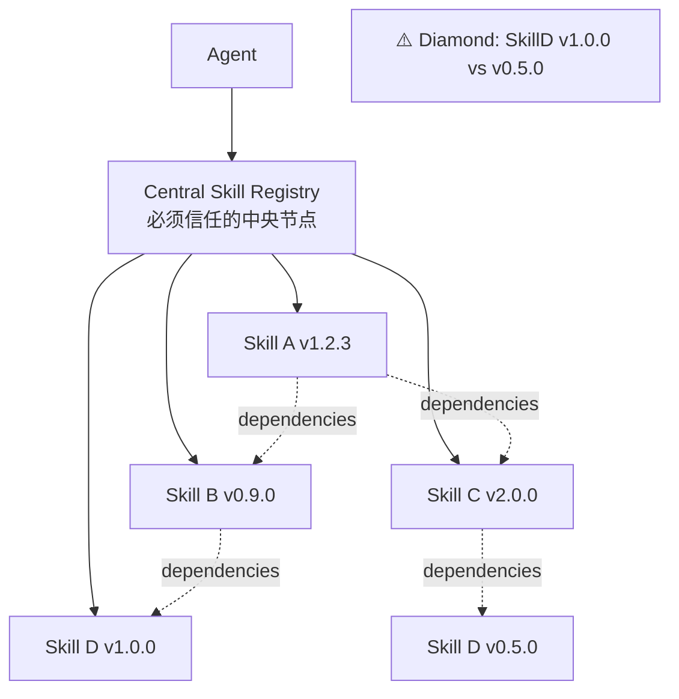
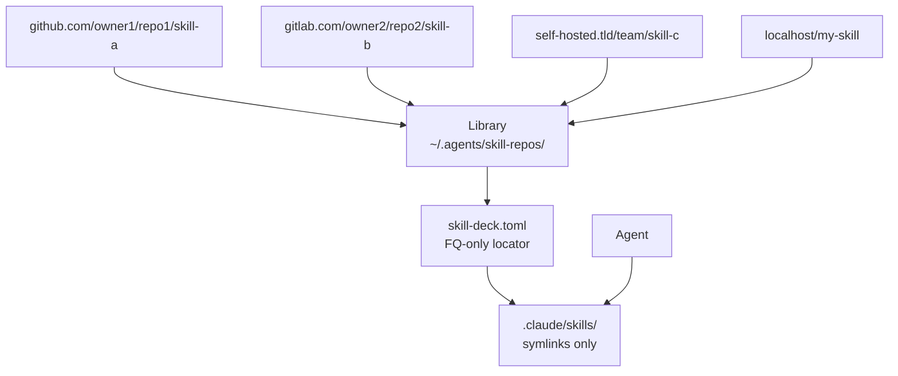
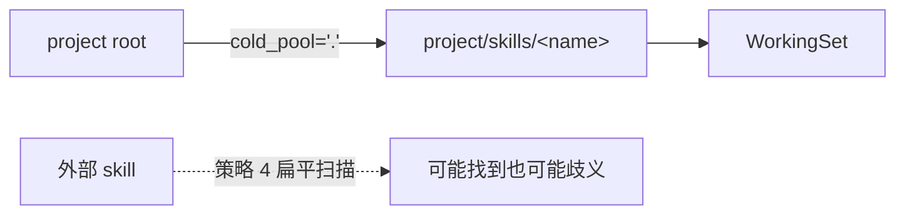
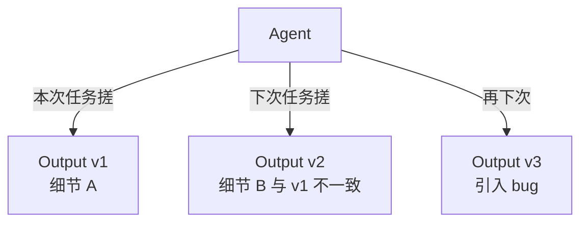
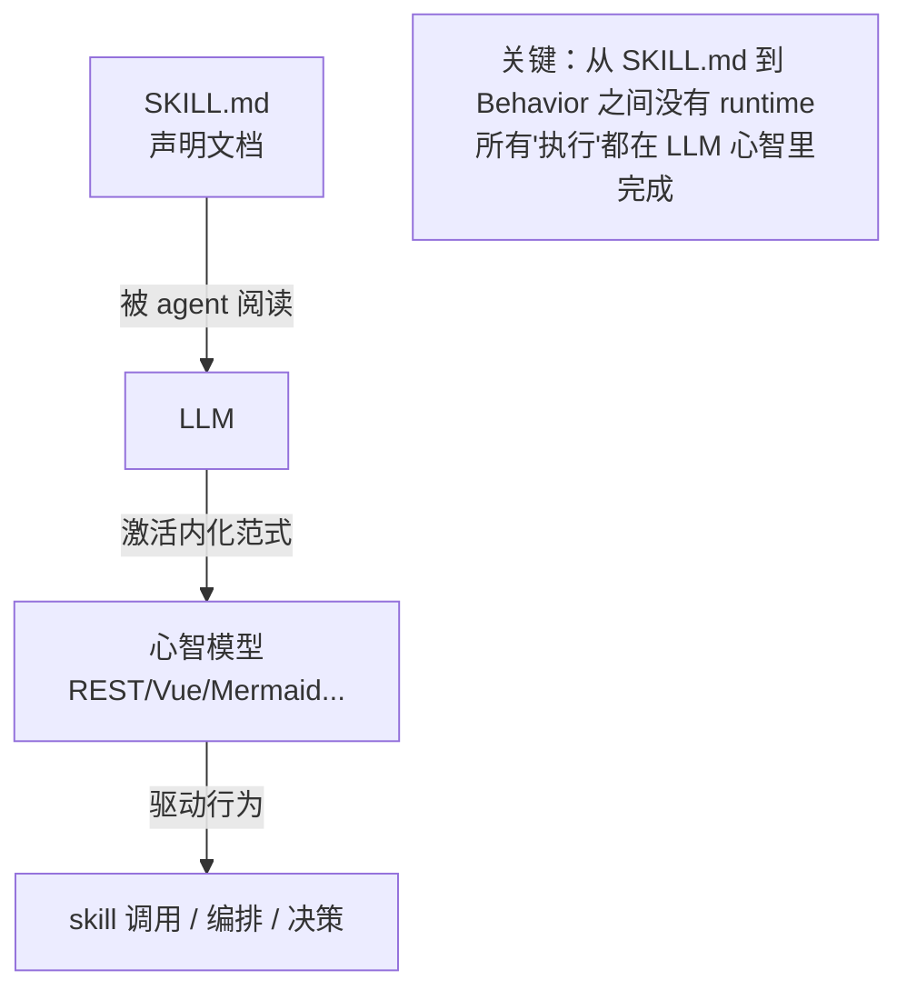
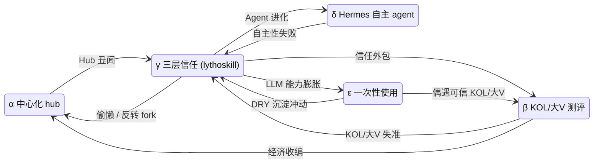

# Skills as Flat Controllers — 从软件工程历史看 Skill Mesh 演化

> 去中心化、扁平、状态外置——这不是 lythoskill 的发明，是软件工程史已经走过的路；agent + skill 是同一刀在 LLM 时代的复现。
>
> 本文承担 ADR-20260502012643544 的深度论证：列出选型对照、抽取历史教训、做诚实的 steel-man 推演。给"在意架构选型的人"看，不给"只想跑起来的人"看。

---

## TL;DR

Lythoskill 的核心架构选择——**Go-module 风格去中心化 FQ locator + 扁平无状态 skill + 状态外置到 agent + 协作走 combo（不写 dependency 字段）**——不是工程师拍脑袋的偏好，而是在"多作者天然共存"这条约束下，**结构上唯一能跑通的形态**。

**心智基础**：肥 agent + thin skill + 成熟基建——agent 时代是 PC 时代去中心化钟摆的重启，agent 大幅压低了去中心化的入场门槛。沉淀压力在每一层（模型权重 / agent CLI / lythoskill / 单个 skill / 项目本地）都会递归发生，每一层选谁运营 = 这一层能力归属于谁。

**论证结构**：四种选型的依赖 DAG 对比、七条软件工程史教训（含递归薄层原则）、五种完整可行的替代生态形态（α/β/γ/δ/ε）的 Pareto 前沿映射、形态间迁移 + 钟摆反向条件的博弈空间动力学，以及 context window 作为不可扩展地址空间的 OS 内核隐喻（6502 / 虚拟内存 / 内核态分层）。

**结论**：pattern 对得上，γ 是 Pareto 前沿上的非支配解；α（中心化 Hub）是支配劣解；β/δ/ε 各有合法位置；7 条顶级边界条件 + 6 条钟摆反向条件需持续观测。详见「Steel-man」与「博弈空间动力学」两节。

---

## 阅读地图

按"想要什么"定位章节：

| 想要的内容 | 去哪一节 |
|----------|---------|
| 30 秒看完核心结论 | **TL;DR**（上方） |
| 心智基础——为什么这样设计 | **§核心洞察 §3 心智基础**（含 §3.1 沉淀递归 / §3.2 利益代表 + alter / §3.3 拓扑形态学） |
| 为什么 cortex 与 deck 是 OS 隐喻 | **§Context window 即地址空间**（6502 / 虚拟内存 / 内核态分层） |
| 工程选型直接对比 | **§依赖 DAG 选型对照**（A/B/C/D） |
| 历史先例作为论据 | **§软件工程史的七条相关教训** |
| 反方的完整生态形态 | **§Steel-man → α/β/γ/δ/ε 五形态 + Pareto 前沿** |
| 边界条件 + 钟摆反向 + 形态迁移 | **§Steel-man → §顶级边界条件 + §博弈空间动力学** |
| 三层信任架构（卖家秀/KOL/大V/买家秀） | **§Steel-man → 形态 γ → Curator 三层防线** |
| Identity 让位 / Hermes 自主进化 | **§Player = Facade** + **§Steel-man → 形态 δ** |
| 待开放问题与未来线 | **§未决问题与开放线** |

---

## 核心洞察

### 1. 四种系统是同一抽象的不同实例

| 系统 | 原语 | 编排者 | 协作模式 | 多作者性 |
|------|------|--------|---------|---------|
| 企业级微服务 | stateless service | service mesh / orchestrator | API Gateway / BFF | 同公司，弱 |
| 前后端分离 | REST API | SPA | BFF | 同团队，弱 |
| 生成式 UI/UX | 无状态组件（shadcn-style） | LLM 编排器 | 复合组件 | 跨团队，中 |
| **Agent + Skills** | 无状态 skill | Agent | combo | **天然异作者，强** |

四者共享同一骨架：**编排者在扁平、无状态原语上做一次性组合，状态外置**。

### 2. "多作者天然共存"是 skill 生态独有、最强的约束

| 系统 | 作者集中度 | 共享内存模型？ |
|------|-----------|---------------|
| 微服务 | 同公司 | 是（共享数据库 schema、CI/CD、内部 SDK） |
| 前后端分离 | 同团队 | 是（共享 API contract、auth flow） |
| 生成式 UI 库 | 跨团队 | 部分（共享 design system） |
| **Agent + Skills** | **天然异作者** | **没有** |

Skill 来自不同 GitHub repo，作者各异，没有同公司/同团队的内存模型可以共享。在这条约束下：

- **扁平 + 状态外置不是工程优化"选择"，而是系统能成立的必要条件**
- 企业级微服务可以选择"不那么微"（modulith 也合理），skill 没这个奢侈
- TCG 类比比微服务类比更精确——它内置了"卡来自不同作者"的约束

### 3. 心智基础：肥 agent + thin skill + 成熟基建（去中心化的再一次回潮）

去中心化与中心化在计算史上是一个**周期性钟摆**，不是单调演化：

| 时代 | 形态 | 谁拥有数据/算力 | 入场门槛 |
|------|------|---------------|---------|
| PC 时代（1980s–2000s） | 肥 client，去中心化 | 用户本地 | 高（需要开发者技能） |
| 移动/云时代（2010s–2020s 早期） | 瘦 client + 肥云 | 平台 | 极低（但锁定平台） |
| **Agent 时代（2020s+）** | **肥 agent + thin skill + 成熟基建** | **用户本地 agent** | **被 agent 显著降低** |

**为什么这次去中心化能再次起来**：PC 时代的去中心化输给了云时代，**根本原因是入场门槛**——管自己的服务器、装自己的依赖、调自己的集成都要开发者级技能，普通用户用不起来。云/平台用 app store 和 SaaS 隐藏了这一切，代价是把所有人锁进平台。**Agent 时代的关键差异是入场门槛被 agent 大幅压低**：一个普通用户配上流畅的 agent，就能操作 git / gh / npm / bash / file system / web API——等于免开发者门槛地继承全套 PC 时代开发者工具链。**这一次门槛条件变了，去中心化的胜算也变了**。

**这一判断定义了 lythoskill 整套架构选择的根框架**：Go-module 式去中心化在 agent 时代具备再次发生的条件（PC → 移动 → agent 钟摆）；agent 大幅度降低技术门槛是关键变量；因此 **"肥 client/agent + thin skill + 成熟基建"** 是 lythoskill 的心智基础。

**三元结构详解**：

| 层 | 角色 | 具体内容 |
|----|------|---------|
| 肥 agent | 通用控制面 | 持有 state、跑 orchestration、操作通用工具链（git/gh/npm/bash/web）。本质就是"coding agent = 通用智能 agent" |
| thin skill | 局部声明 | SKILL.md 即 prompt，无 skill 级 dep manager / registry / runtime。Skill 是 thin 的，因为它的工作只是"激活 agent 已有心智的特定切片" |
| 成熟基建 | 通用底座 | npm / pip 管重资产、GitHub/GitLab 管社交层、Hermes/OpenClaw 管 identity、文件系统/shell 管原始操作。Lythoskill 不在这些已成熟的层重新发明 |

```mermaid
graph TB
  subgraph thin["thin skill — 局部声明"]
    direction LR
    S1["SKILL.md<br/>(deck 治理)"]
    S2["SKILL.md<br/>(报告生成)"]
    S3["SKILL.md<br/>(调研流程)"]
  end

  Agent["🤖 肥 agent — 通用控制面<br/>━━━━━━━━━━<br/>持有 state · 跑 orchestration<br/>操作通用工具链<br/>(git / gh / npm / bash / web)"]

  subgraph infra["成熟基建 — 通用底座"]
    direction LR
    I1["npm / pip<br/>(重资产)"]
    I2["GitHub / GitLab<br/>(社交层)"]
    I3["Hermes / OpenClaw<br/>(identity)"]
    I4["文件系统 / shell<br/>(原始操作)"]
  end

  S1 -.|激活心智切片| Agent
  S2 -.|激活心智切片| Agent
  S3 -.|激活心智切片| Agent

  Agent -->|操作| I1
  Agent -->|操作| I2
  Agent -->|操作| I3
  Agent -->|操作| I4
```

> **图注**：三元结构的可视化。**thin skill** 是 markdown 即 prompt，自身无 runtime / 无 dep manager / 无 registry——它们的工作只是把 agent 已有的心智切片调出来。**肥 agent** 是中心通用控制面，所有 state、orchestration、工具链操作都聚拢在这里。**成熟基建** 是底层通用底座，agent 直接调用，lythoskill 不在这一层重新发明。三元的箭头方向定义了 lythoskill 决策的判据：**让 agent 更肥（强通用性）、让 skill 更瘦（更易共存）、让基建分摊更多（拒绝重新发明）的方向才对得上心智基础**。

**这套三元结构是 lythoskill 全部具体决策的母模式**——FQ locator、no `dependencies:` 字段、no skill registry、deck 治理而非依赖解析、player facade 让位给 identity 系统、L3-c fork 复用 GitHub clone 原语——都是从这个结构推出来的。后续遇到任何"是否要做这个能力"的问题，都先映射到三元上：**它让谁更肥？让谁更瘦？让基建分摊更多还是更少？** 让 agent 更肥（强通用性）、让 skill 更瘦（更易共存）、让基建分摊更多（拒绝重新发明）的方向才对得上心智基础。

#### 3.1 为什么 agent 必须"肥"——以及沉淀压力的递归性

三元结构里"agent 必须肥"不是工程偏好，而有**结构性动因**：

- **从第一性原理推**：纯模型有些能力是永远做不好的——精确状态保持、长期记忆、确定性外部副作用、跨进程编排——这些必须靠 agent 把成熟工具链和外部能力**内置化**。Agent 的"肥"是它存在基础迫使它向通用工具链 + 外部基础设施扩展的必然结果。
- **沉淀压力是递归的**：思想实验——一个智能足够强的 agent，**完全不需要预先认识"skill"概念**。你给它一份 skill 使用说明书 + 一个 SKILL.md，它照样能正确解读和执行。但事实上 Claude Code、Kimi CLI 等 agent CLI 仍然**内化了 skill 概念**——把 SKILL.md 当作特殊一等公民来扫描、加载、激活。
- **为什么仍要内化？同一个理由——沉淀**：和 npm/pip、combo skill、deck 的沉淀逻辑相同——DRY、consistency、bug-resistance、避免每次重新搓。Agent vendor 在 CLI 层做的"内化 skill 概念"，本质上和项目层"沉淀 combo skill"是**同一种沉淀压力在不同层级的实例**。

| 层级 | 沉淀的内容 | 由谁运营 | 沉淀理由 |
|------|----------|---------|---------|
| 模型权重 | 通用世界知识 + 推理能力 | 模型 vendor | 训练成本太高，每次推理重学不可行 |
| Agent CLI | Skill 加载/激活/调度心智（"什么是 skill"） | Agent vendor (Claude Code / Kimi CLI 等) | 每次重写 skill 加载逻辑昂贵 |
| **Lythoskill (deck/library 层)** | **Skill 治理 + 卡组组合 + 评测约定** | **开放生态（lythoskill）** | **每个项目重发明 skill 治理昂贵** |
| 单个 skill | 具体工作流 | Skill 作者 | 每次重写工作流昂贵 |
| 项目本地 | combo skill 团队 SOP | 项目用户 | 每个项目重发明 SOP 昂贵 |

**洞察**：沉淀不是单点行为，是**递归在每一层都会发生**。每一层选择"运营者是谁"，就决定了这一层的能力归属于谁。Lythoskill 自觉地占据 deck/library 层的沉淀位置——这不是抢任何其他层的工作，而是承担一个原本就该被沉淀、否则会被其他层（agent vendor 上挪、或单个项目下挪）填补的层级。

> **对照视角**：本表看的是"**谁** 在沉淀 **什么内容**"——由谁运营 = 该层利益代表（参见 §3.2）+ 该层心智归属。**§教训 7 的递归薄层表**则看的是同一图谱的另一面——"**什么职责** 下沉到 **什么基础设施**"。两表是同一组结构事实的两个角度：本表回答"为什么 lythoskill 应该存在",教训 7 回答"为什么 lythoskill 应该 *小*"。

#### 3.2 每一层都有"利益代表"——agent 层与 user 利益的结构性微妙错位

上面"由谁运营"那一列同时也是"由谁的利益代表"。每一层的运营者是商业实体或社区时，该层的优化函数会带上运营者的目标——这不是道德判断，是**结构事实**。

**Lythoskill 接受一条结构性基线事实**：除非用户自己搓 agent，否则 agent 代表的利益终究和 user 微妙不一致。

这不是说 agent vendor "坏"——它和"广告平台优化点击率不是因为想骗人，而是因为它的存在基础就是这个目标"是同一类结构性事实。Agent vendor 的合法商业利益（增长 / 留存 / 责任对冲 / 模型成本控制 / 与生态合作伙伴的协议）和具体用户的合法利益（**这一次任务**做对、保持判断权、控制成本、随时退出）**不是天然对齐的**——它们经常 directionally 一致，但在边际上、在长尾上会出现微妙偏离。

应用到沉淀递归表：

```mermaid
graph LR
  subgraph misaligned["⚠️ 微妙错位层"]
    direction TB
    M1["模型权重<br/>↳ 模型 vendor"]
    M2["Agent CLI<br/>↳ Agent vendor<br/>(背景常量)"]
    M3["单个 skill<br/>↳ Skill 作者<br/>(卖家秀)"]
  end

  subgraph aligned["✅ user 一致层"]
    direction TB
    A1["Lythoskill<br/>↳ 开放生态"]
    A2["δ Hermes<br/>↳ 自建 agent"]
    A3["项目本地<br/>↳ 用户自己"]
  end

  M1 -.|"hedge: 模型可换<br/>lythoskill 模型无关"| A1
  M2 -.|"hedge 1: δ 路线"| A2
  M2 -.|"hedge 2: 周边层<br/>vendor-neutral"| A1
  M3 -.|"hedge: L3 买家秀<br/>+ fork + arena"| A3
```

> **图注**：左侧三层是结构性微妙错位（不是道德判断，是利益代表者不同的客观事实）；右侧三层是与 user 利益结构性一致的层。每条虚线箭头是一条"结构性 hedge 路径"——告诉用户当某层有偏时，可以从哪一层得到对冲。注意 Agent CLI 层有两条 hedge 路径（自建 agent 是一条，让其他层 vendor-neutral 是另一条），这是"绝大多数不会自建 agent 的用户"也仍然能够对冲的结构原因。详细对照见下表。

| 层级 | 利益代表者 | 与 user 利益的关系 | 用户的结构性 hedge |
|------|----------|------------------|------------------|
| 模型权重 | 模型 vendor | 微妙错位（训练目标 ≠ 单次任务最优） | 模型可替换（lythoskill 设计模型无关） |
| Agent CLI | Agent vendor | **微妙错位（vendor 商业目标 ≠ user 任务目标）** | 1）自己搓 agent（δ Hermes 路线）；2）让其他层 vendor-neutral，使 agent 即使有偏，user 仍能从其他层得到对冲 |
| Lythoskill (deck/library) | 开放生态 | 与 user 一致（结构上无 vendor，社区运营） | Lythoskill 自身的开源 + 公开标准 + 多 CLI 兼容 = 让"sediment 层不被任何 vendor 收编"成为结构事实 |
| 单个 skill | Skill 作者 | 微妙错位（skill 作者也是"卖家秀" L1） | L3 买家秀 + 用户可 fork（L3-c）+ arena 试穿 |
| 项目本地 | 项目用户自己 | 一致 | 完全 user-controlled |

**结构性结论**——这条事实不是新的反向条件，是**整个博弈空间的背景常量**：

1. Agent 层的微妙利益错位是**永远存在的背景压力**，不需要任何 trigger 也每天都在小规模地发生（Agent 可能 subtly 偏向某些 skill / 某些建议方式 / 某些工具选择，**而 user 通常不会察觉**）。
2. 唯一**完全**消除这个错位的路径 = 用户自建 agent（δ Hermes / OpenClaw 路线）——这是 δ 形态在 Pareto 前沿上有合法位置的根本理由，不只是"自主性偏好"。
3. 对**绝大多数不会自建 agent 的用户**，**结构性 hedge 必须来自其他层**——这就是为什么"周边层 vendor-neutral"特别重要：当 agent 层有偏时，让 user 在 skill / sediment / infra 层有可用的非 vendor 替代路径。
4. 这条结构性背景反过来定义了 lythoskill 的合法工作位置：**它在一个本来就需要被中性化的层上承担运营**，而不是与任何现有层重叠或竞争。

这条同时是 §博弈空间动力学 §2 钟摆反向表"沉淀层 vendor 垄断"那一行的**结构性根基**——那一行描述的是 trigger 出现时的具体机制，本节描述的是即使 trigger 不出现，背景压力也持续存在的事实。

**附注：lythoskill 的成功条件不是"支配"，是"alter 选择持续可达"**：

如果哪一天博弈空间动力学（§形态迁移 + §钟摆反向）真的把 lythoskill 形态边缘化——比如 vendor 的封闭沉淀层吸走 90% 用户、监管 mandatory vetting 让中央认证成主流、平台 lock-in 把开放工具链推到边角——**lythoskill 仍然有它的价值**：作为"自己搓 agent（δ）+ 开放 skill 沉淀层（γ）"这条 Pareto 前沿点的**可达 alter 选择**。

option value 的存在本身就是博弈空间的一部分：

- 当 mainstream 用户即使不选择 alter，仅仅是 alter 存在 → vendor 的支配劣解决策受到结构性约束（一个有现成替代路径的市场，不能任意定价）
- 当少数用户实际选择 alter（自建 agent + 开放沉淀） → 他们享有完整的 user-interest 对齐
- 当 mainstream 出现一次失败（trust 危机、vendor 政策变更、合规事件）→ alter 路径已经 ready 接住

**所以 lythoskill 不需要"赢"也是有意义的**——只要 alter 选择持续 reachable，这条 Pareto 前沿点就不会消失。这反过来也定义了 lythoskill 不该追求的东西：**不要为了 mainstream 化而牺牲 alter 性**——一个被 vendor 收编的"伪 alter"不是 alter，是支配劣解的延伸。

> **与 §Steel-man 的衔接**：本节给出的"alter 选择持续可达"是抽象论点；§Steel-man 把它落地为五种具体形态（β/γ/δ/ε 各占 Pareto 前沿不同轴 + α 是支配劣解）。两节是同一论点的抽象版与列举版：本节解释 *为什么* 多个 alter 同时存在有结构价值，§Steel-man 列出 *具体哪些* alter 在前沿上、各自的 skin in the game 在哪。读完本节再读 §Steel-man，会更容易看出"非支配"不是技术对比的结论，而是博弈空间结构性事实的呈现。

#### 3.3 拓扑形态学：从云时代 thin wrapper 到 agent 时代撕破

上面"agent 层有结构性利益错位"和"alter 选择存在即价值"——把镜头拉高一格，会发现这两件事其实是**用户与开放生态之间拓扑结构变迁**的两个面。可以做一次拓扑形态学分析。

**三时代的拓扑节点 + 边**：

```mermaid
graph LR
  subgraph PC[PC 时代：直连但门槛高]
    U1[User] <--> OS1[Open Source / 工具链]
    Note1[直接控制<br/>但需要开发者能力]
  end
  subgraph Cloud[云时代：低门槛但插入 thin wrapper]
    U2[User] --> CV[Cloud Vendor<br/>thin wrapper] --> OS2[Open Source]
    CV -.|"吃 OSS<br/>倒转卖钱"| Rent[租金提取]
    Note2[低门槛<br/>但失去直接控制]
  end
  subgraph AgentEra[Agent 时代：agent 撕破 wrapper 的可能 vs 替代 wrapper 的可能]
    U3[User] --> Agent
    Agent -. 撕破路径 .-> OS3[Open Source]
    Agent -. 替代 wrapper 路径 .-> NewWrapper[Vendor 新 wrapper] --> OS3
    Note3[拓扑分叉<br/>取决于 agent 层是否被 vendor 收编]
  end
```

**云时代问题的核心**：cloud vendor 插入到 user 与 open source 之间作为**拓扑必经节点**——大量价值由 OSS 创造，但 vendor 通过"低门槛 + 集成 + 托管"包装层提取租金。"吃开源成果倒转过来卖钱"的 MongoDB / Elasticsearch / Redis license 战争，本质就是 OSS 项目被结构性地剥夺了和用户的直接连接。

**Agent 时代为什么有可能撕破这个 wrapper**：

cloud vendor 的核心价值假设是 *"用户没能力直接消费 OSS"* ——需要打包、托管、UI、auth、计费、SLA 等等。**但 agent 可以做绝大部分这些事**：agent 能 git clone、能跑 docker compose、能配 nginx、能写 deploy 脚本、能查文档、能 debug。**用户拥有 agent 之后，cloud vendor 的"thin wrapper"价值假设失效**——拓扑上 user → agent → OSS 路径变得可达，绕过 cloud vendor 成为现实选项。

**"下云"运动是同方向的早期信号**：这不是孤立的预测——"下云"（cloud repatriation）已经在 agent 兴起之前就开始撕破 wrapper：37signals/DHH 高调离开 AWS、Dropbox 自建存储、Basecamp 公开发布"我们离开云后省了多少钱"——这些案例预示了同一拓扑变迁，只是当时**主要由经济驱动**（云成本超过自建）+ **限于有团队/有运维能力的少数派**。

Agent 能力的崛起把这条路径从"有钱有团队的少数派选择"**扩展到"普通用户可达"**——agent 能填补"下云"原本需要的运维能力门槛，这是 lythoskill"心智基础"中"agent 大幅压低去中心化入场门槛"的具体形式之一。

**但这不是必然——拓扑分叉**：

agent 层本身可以选择两种位置：

| 拓扑选择 | 描述 | 结果 |
|---------|------|-----|
| **撕破 wrapper** | Agent 帮用户直连 OSS，把 wrapper 收益还给 OSS / 用户 | OSS 重获和用户的直接关系；用户拿回控制；vendor wrapper 收益缩水 |
| **替代 wrapper** | Agent vendor 把自己定位成新的"必经节点"——专属 skill 格式 / API-only 集成 / 内置封闭沉淀层 | Wrapper 不消失，只是从 cloud vendor 转移到 agent vendor；OSS 仍被夹在中间 |

**这是 §3.2 agent 利益错位与 §博弈空间动力学 §2 钟摆反向条件"沉淀层 vendor 垄断"在拓扑层的统一表达**：agent 层的微妙利益错位 = 拓扑上 agent 有动机插入自己作为新 wrapper；钟摆反向条件 = 这个动机的具体路径。

**Lythoskill 在这个拓扑里的位置**：

```mermaid
graph LR
  U[User] --> Agent
  Agent --> OS[Open Source<br/>npm/pip/GitHub]
  Agent -.|"读取声明"| Lytho[Lythoskill<br/>deck.toml + sediment]
  Lytho -.|"FQ locator 直指"| OS
  Note[Lythoskill 不在 user→agent→OSS 主链路上<br/>它是 sediment 层 facade<br/>声明而非中介]
```

**关键设计选择**：lythoskill 故意**不**站在 user → agent → OSS 主链路的中间。它是**旁路声明层**——deck.toml 描述"用户期望什么 skill 出现"，sediment 沉淀"反复用到的工作流"，但 agent 直接通过 FQ locator 去 OSS 取——lythoskill 不托管 skill、不运行 skill、不解析 skill。

这个拓扑选择是 lythoskill 撕破 wrapper 派 vs 替代 wrapper 派的**结构站队**：

- ❌ 不当 cloud-style 中介（那等于复制要被 agent 撕破的形态）
- ❌ 不当 agent-vendor-style 内置封闭沉淀（那等于配合替代 wrapper 派）
- ✅ 当 sediment 层 facade——纯声明，agent 自取，OSS 自管

**结论**：拓扑形态学揭示——lythoskill 不仅要做对 deck/library 层，还要**做对 deck/library 层在整个拓扑里的位置**——不是节点，是声明 + 旁路。这是与 cloud 时代教训（不当 thin wrapper）+ agent 时代趋势（撕破 wrapper）+ §3.1/§3.2 沉淀递归与利益错位结构性结论的统一。

---

## Context window 即地址空间：cortex 与 deck 的 OS 内核隐喻

Agent 的 context window 不是"可以优化的参数"，是**不可扩展的硬件约束**——和早期 CPU 的有限地址空间一样，"寻址空间就这么大"。Lythoskill 的全部设计，从 skill-deck 到 cortex，本质上是**在这个硬约束下写一套 paging 治理内核**。

### 地址空间的三层治理：resident handler、lazy load 与 compaction

| 内存管理概念 | Context window 对应物 | lythoskill 的工程落地 |
|-------------|----------------------|----------------------|
| **常驻页 / Zero page**（快存取、极有限） | 始终驻留的 front matter + handler | SKILL.md 的 front matter；ADR/epic/task 的头部状态块 |
| **按需分页 / Bank switching**（引用时映射） | Lazy load：引用时才会拉取全文 | 文件路径即地址；agent 只在需要时 `Read` 目标文件 |
| **Compaction / 内存整理** | Agent 的 compaction 机制 | 当 context 接近上限时，agent 决定什么保留为摘要、什么逐出；front matter 提供结构化信号帮助 compaction 决策 |

**关键洞察**：常驻页放什么、bank 怎么切，决定了系统整体效率。如果视图化一个 context，compaction 也在治理同一个 address space——治理质量取决于**前端是否有清晰的 handler 结构**。

### Cortex：状态空间的简易 OS

Cortex（ADR / epic / task / wiki）的第一性不是"文档"，是**context window 的资源管理**：

- **目录即状态机**：`adr/01-proposed/` → `02-accepted`，`tasks/02-in-progress/` → `04-completed`——文件系统目录是 machine-readable 的进程状态机
- **文件即内存页**：标题 + Status History = page header（handler），正文 = payload（banked content）
- **引用即地址解析**：`cortex/adr/02-accepted/ADR-2026...` 是虚拟地址，agent 按需寻址，不需要全文扫描

传统项目文档把"写给人看"当作第一性；cortex 把"写给 agent 的 context window 看"当作第一性。这就是**简易 OS** 的含义——它不是文档系统，是在不可扩展的地址空间上的一层虚拟化。

### Skill-deck：能力空间的虚拟内存管理器

如果把 cortex 看作"数据空间"的 OS，skill-deck 就是"代码空间"的虚拟内存管理器：

| OS 概念 | skill-deck 对应物 |
|--------|------------------|
| **地址空间预算** | `max_cards = 10`——硬约束，超限即拒绝 |
| **页表** | `.claude/skills/` 下的 symlink——把虚拟 skill 名映射到物理存储 |
| **交换空间/磁盘** | `~/.agents/skill-repos/` 冷池——真正的内容在这里 |
| **零拷贝映射** | Symlink 本身——agent 读 working set 时文件系统代理解析到冷池，内容不重复 |
| **内存保护 / 沙箱** | `deny-by-default`——未声明的 skill 从页表中抹除，agent 的 `readdir()` 根本看不到 |
| **MMU / 调和器** | `deck link`——保证声明状态与物理布局一致 |
| **临时映射 / 中断向量** | `transient` skill——带 TTL 的临时页，处理完即撤销 |

核心操作 `deck link` 的本质：**声明式配置驱动物理布局，agent 只读取最终的物化视图**。这和 cortex 的 `probe`/`index` 是同一套哲学。

### Innate：eager-loaded 的内核态代码

Deck 的 `innate` section 存放的是**常驻内存**——不是 lazy load，而是 eager load。当前实现尚未有显式机制保证这种常驻性。理想行为不是"compaction 后重新注入"，而是让 innate skill 成为 agent context 整理时的 GC root——像内核页在内存压力下不被换出一样，innate 应该在地址空间自然膨胀（类似 memory leak）触发 compaction 时直接存活。具体实现机制待深入调研，目前仅为架构方向。架构方向明确：

- **Innate skill = 内核态**：在上下文发生不可逆变化（compaction、session handoff、subagent 切换）后，应第一时间回驻
- **Tool / combo = 用户态**：按需加载，用完可换出
- **Transient = 中断向量 / DMA**：临时映射，带 TTL，处理完即撤销

这种分层让 agent 在地址空间耗尽时，**优先保护 innate 层的完整性**——就像 OS 在内存压力下优先保护内核页。

### 合起来：不是工具集，是 Agent OS 的 bootloader

把 cortex 与 skill-deck 放在一起，lythoskill 覆盖的是 Agent OS 的核心子系统：

| 子系统 | 对应组件 | 功能 |
|--------|---------|------|
| 进程管理 | `project-cortex` | Task/Epic 的创建、状态跟踪、上下文切换 |
| 虚拟内存（数据） | `project-cortex` | 通过引用 ID 实现项目知识的按需加载 |
| 模块加载器 | `skill-deck` | Skill 的映射、校验、卸载 |
| 内存保护 | `skill-deck` | `deny-by-default`、`max_cards` 预算、symlink 隔离 |
| 文件系统总线 | 两者共用 | Markdown + 文件系统作为统一总线和 IPC 媒介 |
| Shell/CLI | 两者共用 | `bunx @lythos/...` 提供用户态接口 |

当前版本更像 **bootloader + 保护模式初始化**——核心机制已就位，但调度器（根据 Task Card 自动分配 subagent）、agent 间信号机制（基于文件系统事件的 IPC）、权限模型（不同 agent 的 skill-deck 视图隔离）等子系统尚未完整。

架构方向已经清晰：**在 context window 这个不可扩展的硬件限制下，用文件系统、symlink 和声明式配置，构建完整的虚拟化层**。Lythoskill 不是"另一个工具"——它是在为 agent 写内核。

### 递归印证

Cortex + deck 的设计是 lythoskill 三元结构的**自我应用**：

- **肥 agent**：Claude Code / Kimi CLI 持有项目上下文，操作文件系统、git、shell
- **Thin handler**：front matter、Status History、symlink、deck 声明——只传指针，不传载荷
- **成熟基建**：文件系统、git、GitHub、markdown 标准——不在这些层重新发明

Skill 是 thin 的，因为 context window 宝贵。Project governance 也是 thin 的，**因为同一个 context window 宝贵**。两者是同一原则在不同尺度的实例。

---

## 依赖 DAG 选型对照

### 选型 A: 中心化 Hub + Registry + Skill-level Dep Manager



**问题**：
- Diamond dependency 地狱（与 npm/Maven 完全相同的失败模式）
- 中心化信任不可避免（注册流程、审核、撤销）
- 多作者把 skill 上传到中央 = 接受单一治理 → 与"天然异作者"内禀冲突
- Context 膨胀：dep resolver 必须把整个传递闭包加载

### 选型 B: Go-module 风格去中心化 FQ Locator（**lythoskill 选择**）



**特征**：
- Locator = 路径本身，无需中央协调（github / gitlab / self-hosted 同等公民）
- 版本锚定 = git commit / tag（与 Go module 一致）
- 没有 skill-to-skill dependency 字段——协作走 combo
- Cold Pool（物理隔离，Agent 不可见）与 Working Set（运行时可见）严格分离，deck 作为准入控制层

### 选型 C: `cold_pool="."` + bare name fallback（**已弃用**）



**问题**：
- lythoskill-only 特例，外部用户首次贡献时困惑
- bare name 与 FQ locator 共存 → 多义性永久存在
- 策略 4 扁平扫描有 O(n) 性能 + 歧义风险（参见 ADR-20260502012643244）

### 选型 D: 完全 Ad-hoc，不存在 skill 概念



**问题**：
- 没有 DRY → 重复劳动
- 没有一致性 → 同一类任务输出漂移
- 没有抗 bug → 每次搓都可能引入新 bug

**洞察**：选型 D 的存在揭示了 skill 的**根本理由**——不是技术依赖，而是**沉淀**（DRY / consistency / bug-resistance）。Skill 不存在时 agent 仍可用通用能力完成任务，但代价是漂移与 bug。

### 对照表

| 维度 | A: 中心化 Hub | B: Go-module 去中心化 | C: 项目本地 fallback | D: Ad-hoc 无 skill |
|------|---------------|----------------------|---------------------|-------------------|
| Locator 唯一性 | 中央 namespace | 路径即 ID | 多义 | N/A |
| 多作者支持 | 需要 onboarding 流程 | 天然支持 | 主作者+少量外部 | 每次自搓 |
| Diamond dep 风险 | 高 | 不存在（无 dep 字段） | 不存在 | 不存在 |
| 中心化信任 | 必须 | 不需要 | 不需要 | 不需要 |
| 沉淀能力 | 强 | 强 | 弱（lythoskill-only） | 无 |
| 历史先例 | npm / pypi / Maven | Go module / git submodule | （无成功案例） | （pre-工具时代） |

---

## 软件工程史的七条相关教训

### 教训 1: Maven 早期前端 wrapper（frontend-maven-plugin / bower-maven）

2014–2016 年期间，Java 生态尝试把 npm/bower 包装进 Maven build。结果：

- 工具同步滞后（bower 已死，wrapper 还在）
- 生态价值倒置（前端工具被 Java 流程绑架）
- **教训**：不要在已经成熟的工具之上套一层更重的外壳。Skill 也不应该在 npm/pip 之上重建包管理器。

ADR-20260502012643544 的 Decision rule "重资产走 npm/pip" 直接来自这个教训。

### 教训 2: Bower 与 npm 的合并

Bower 曾是前端独立的 dep manager。npm 一旦支持前端包，Bower 在 2017 年被官方推荐迁移。

- 单一生态不需要两个 dep manager
- **教训**：在现有 dep manager（npm/pip）上做 skill-level 的"小 dep manager"会重复 Bower 的命运。

### 教训 3: Go module 拒绝中心化 registry

Go 1.11 引入 module，故意选 `host/owner/repo` 作为 module 标识符，**不做中心化 registry**。

- 避免 npm-style 中心节点的 supply chain 风险（如 left-pad 事件）
- 多托管商共存（github.com / gitlab.com / self-hosted）
- proxy 缓存层（proxy.golang.org）作为可选的镜像，不是必须的中央
- **教训**：去中心化 + 路径即 ID 在生产生态中已被验证。Lythoskill 直接复刻这个设计。

**进一步观察——Go module 自然继承 GitHub 社交层**：选择 `host.tld/owner/repo` 作为 ID，等于把"社交层和 hub 职责一部分下沉到 GitHub/GitLab"，而不是另起炉灶造一个"功能没有那么强的中心化 registry"。GitHub 已经提供 issues / PRs / forks / stars / discussions / search / 通知 / 权限模型——这些 infra 的成熟度远超任何"几天搓出来的 skill hub"。Lythoskill 复刻这个设计 = 自动继承全套 GitHub 社交基础设施，零新建 infra。Fork-as-L3-c（参见 γ 形态的 L3 三种工程形态）正是这个继承的自然产物：用户 fork 一个 SKILL.md 到自己的 namespace 是 GitHub 一直以来的原生操作，不是 lythoskill 新发明的功能。

### 教训 4: REST/SPA 取代 Server-Side Rendering

2010–2018 年间，前端从"服务端渲染 + jQuery"演化为"REST API + SPA"。

- 状态从服务端 session 上提到浏览器
- 编排从 server template 上提到 SPA
- 后端简化为 stateless API
- **教训**：状态外置 + 扁平无状态原语 + 编排上提 = 这套组合在前端已经走完一遍。Agent + Skills 是这条路径在 LLM 编排时代的复现。

### 教训 5: SOA → microservices → modulith 的反弹

2000s SOA → 2015s microservices 狂潮 → 2020s modulith 反弹（Shopify / DHH 公开吐槽过度微服务化）。

- 微服务不是越微越好
- modulith = 模块化的内部边界 + 单一部署单元
- **教训**：克制原则。Skill 内部允许 modulith 风格的内聚（一个 skill 内有多个 internal module），但不要把 internal module 上升为独立 skill。

### 教训 6: shadcn/ui vs Material/Bootstrap

2023 起 shadcn/ui 火爆，理由是它**不是组件库，是组件源代码集合**——你 copy-paste 进项目，自己拥有。

- Material/Bootstrap 是"运行时主题系统"——重，难定制
- shadcn 是"扁平源码模板"——轻，易改
- **特别适合 LLM 生成 UI**：LLM 把 shadcn 组件读进 context，可以自由组合
- **教训**：扁平、无运行时绑定、源代码可读 = LLM 友好的形态。SKILL.md 应该向 shadcn 学习——是 prompt 不是 framework。

### 教训 7: 递归薄层原则与 coding agent 的通用性

把上述六条横向贯穿，浮现出一个**递归性的薄层原则**——lythoskill 在每一层职责上都拒绝重新发明，而是下沉到已经成熟的基础设施：

> **与 §3.1 的对照**：§3.1 沉淀压力递归表看的是"**谁** 在沉淀 **什么**"——5 层运营者（模型 / agent CLI / lythoskill / skill / 项目）的纵向归属。本表看的是"**什么职责** 下沉到 **什么基础设施**"——7 类责任的横向分摊。两表是同一结构事实的两个角度：§3.1 回答"为什么 lythoskill 应该存在"（每一层都需要被沉淀，lythoskill 占的是其中一层），本表回答"为什么 lythoskill 应该 *小*"（其他职责已有更成熟的承担者）。

| 职责 | 下沉到 | 而不是 |
|------|--------|--------|
| 重资产（二进制 / 复杂依赖） | npm / pip / cli 工具（教训 1+2） | 自造 skill-level dep manager |
| 命名 + 去中心化分发 | Go module 风格 FQ locator（教训 3） | 中心化 skill registry |
| 社交层（issues / PR / fork / star / discussions） | GitHub / GitLab（教训 3 推论） | 自建"功能没有那么强的 skill hub" |
| 编排 + 状态 | Agent conversation context（教训 4） | Skill-level session 管理 |
| 模块化边界 | Skill 内部 modulith 风格（教训 5） | 把内部模块强行升级为独立 skill |
| LLM 友好的发布形态 | 扁平 markdown 源码（教训 6） | Runtime framework / 主题系统 |
| Identity / memory / soul（player 真正承担者） | Hermes / OpenClaw 等 identity 系统 | Lythoskill 自建 player identity 层 |

```mermaid
graph TB
  Lytho["Lythoskill 薄治理层<br/>━━━━━<br/>deck 声明<br/>cold pool 组织<br/>L3 私有元数据"]

  subgraph external["7 类职责 → 下沉到成熟基础设施"]
    direction LR
    NPM["npm / pip / cli<br/>(重资产)"]
    FQ["Go module FQ locator<br/>(命名 + 分发)"]
    GH["GitHub / GitLab<br/>(社交层)"]
    AC["Agent conversation context<br/>(编排 + 状态)"]
    MOD["Skill 内 modulith<br/>(模块化边界)"]
    MD["扁平 Markdown<br/>(发布形态)"]
    HM["Hermes / OpenClaw<br/>(Identity 层)"]
  end

  Lytho -.|defer| NPM
  Lytho -.|defer| FQ
  Lytho -.|defer| GH
  Lytho -.|defer| AC
  Lytho -.|defer| MOD
  Lytho -.|defer| MD
  Lytho -.|defer| HM
```

> **图注**：箭头方向是"defer 让出"——lythoskill 不承接这 7 类职责，而是把它们让给已经做得足够好的通用基础设施。这是"为什么 lythoskill 应该 *小*"的可视化版本：每一条 defer 边都是 lythoskill 拒绝重新发明的一次机会。**重要：每一条都不是临时省力，而是结构性地增加 agent 的杠杆**——agent 已经能熟练操作 npm / git / gh / bash / file system，多一层 lythoskill 自造抽象只会减损 agent 的通用性。

**为什么这条原则在 agent 时代比在传统软件工程时代更关键**：

传统软件工程里，"重新发明 X 是浪费" 仅仅是工程效率问题；在 agent 时代，**重新发明 = 与通用工具链竞争**——而这是注定输的赛道。

**根本事实**：把 gh CLI 等通用工具熟练托管给 agent，和开发者亲自操作并无本质差异。开发者工具链（git / gh / npm / bash / file system / curl）已经是**数字文明的通用控制面**。一个能熟练操作这套工具链的 agent，自动获得对绝大部分数字基础设施的访问权——不需要为每个垂直场景再发明一套。

**所以 Claude 的 coding agent 实质就是通用智能 agent 不是没理由的**——

- 它能读写文件 → 它能编辑任何配置 / 文档 / 数据
- 它能跑 bash → 它能调用任何 cli 工具 / 跑任何脚本 / 操作任何进程
- 它能用 git/gh → 它继承全套版本控制 + 协作 + 社交基础设施
- 它能用 npm/pip → 它继承全套软件包生态
- 它能调用 web/API → 它接入剩下所有云服务

**结论**：lythoskill 的"递归薄层"和"coding agent = 通用智能 agent"是同一个观察的两面。Lythoskill 不重新发明任何东西，是因为它认识到 agent 操作通用工具链本身就是足够的抽象层——**多发明一层都会减损 agent 的通用性**。这反过来定义了 lythoskill 的边界：它只做**那些通用工具链上没有覆盖的薄治理层**（deck 声明、cold pool 组织、L3 私有元数据等），其余一切都让出去。

**反例提醒**：每当出现"这个能力可不可以做进 lythoskill"的提议，先问"通用工具链 + agent 操作能不能直接做"——能就别做。Skill registry / dep manager / hub / 社交平台 / identity 系统都属于"通用工具链已经覆盖的领域"，lythoskill 进场只会复制一份更弱的版本。

---

## 声明即 prompt：生态自发演化的 pattern

LLM 已经把 Vue3 / REST / Spring / Mermaid / JSON Schema 等范式深度内化。**SKILL.md 是 markdown，markdown 是 prompt**——选择写法 = 选择激活的心智 = 选择 agent 行为。

| 已经在发生的事情 | LLM 激活的心智 |
|-----------------|---------------|
| Kimi CLI flow type 用 mermaid code block 描述工作流 | 流程图心智（节点 + 边 = 调用顺序） |
| Anthropic SKILL.md 标准是纯 markdown | 文档阅读心智 |
| K8s 用 YAML 声明期望状态 + reconciler 收敛 | 声明式 + 调谐心智 |
| Vue3 SFC `<script setup>` 反应式声明 | 状态绑定心智（deferred ADR E） |
| TypeScript schema 描述 API contract | 类型约束心智 |

**这些不是 lythoskill 的发明**——它们是 LLM 时代各生态自发演化出的 pattern。Lythoskill 的工作只是把它们显式写下来，避免 agent 反复重新发现。



---

## Designer Decks ≠ Dependency Manager

当 skill 作者声称"希望 skill 之间有依赖关系"时，实际诉求几乎都是：

> "如果要做 X 这件事，建议同时带这几张卡。"

这是 **designer-curated bundle**，不是 import-time dep graph。具体生态先例：

| TCG 形态 | Skill 生态对应物 |
|---------|-----------------|
| YGOPro / EDOPro 的 `.ydk` 文件（卡组 export 格式） | `skill-deck.toml` 互换协议（future） |
| 设计师发布的 preconstructed deck / starter deck | 作者发布的"建议卡组"模板（curator 承担） |
| 强 opinionated "构筑卡组"（如 gstack 等） | "高度自闭/自肃"的 opinionated skill bundle |
| 玩家魔改 designer preset | 用户根据本项目 arena 实战日志个性化 deck |
| 看视频/教程学打牌 | wiki + blog 的 combo walkthrough（同时给人和 LLM 抓取） |
| 固定 SOP combo（如"星辰大海三连"） | **lythoskill 的 combo skill**（沉淀团队 SOP） |

**关键区分**：
- **Technical dep** = "skill A import skill B"，需要 dep resolver，与多作者共存冲突 → reject
- **Curated bundle** = "designer 推荐这个组合"，是文档/模板，由 curator 治理 → 保留空间承载

ADR-20260502012643544 的 Decision rule 4（协作走 combo）正是把"固定 SOP combo"沉淀为 combo skill 的机制——designer 写一个 combo skill，发布出去，用户引用它作为起点。**不是 dependency，是 recipe**。

---

## Player = Facade，Identity 让位给 Hermes / OpenClaw

TCG 类比中的 **player** 概念——agent 的自我评估、风格、长期偏好——属于 **identity 层**，不属于 deck 治理范畴。

```mermaid
graph TD
  subgraph Identity[Identity 层 - Hermes/OpenClaw 承担]
    Memory[Memory]
    Soul[Soul/Style]
    SelfEval[Self-evaluation]
  end
  subgraph Lythoskill[Lythoskill 边界]
    Player[Player Facade<br/>暴露接口]
    Deck[Deck/WorkingSet]
    Arena[Arena 实战 log]
  end
  Identity -.|消费 deck 状态 + log| Player
  Player --> Deck
  Arena -.|浮现 deck 相性| Player
```

Lythoskill **不重建** identity 层。Player facade 只暴露：
- Deck 状态读取
- Arena 实战日志输出
- 个性化 combo 链表达

这与 Thin Skill Pattern「重资产下放到现成系统」立场完全一致。Player 浮现态由 arena 实战 log 驱动，等数据足够时由 Hermes/OpenClaw 等下游消费——**不在 lythoskill 内部"演化出" identity，是通过接口让位**。

---

## 方法论：结论先行，实现跟进

**Lythoskill 采取"结论先行"的方法论**：ADR 在实现前定型，实现工作以这些结论为锚——代价是 ADR 长期处于 proposed 状态，红利是后续实现可以稳定收敛，避免设计漂移。

**Agent 阅读 ADR 时应理解**：proposed 状态在本项目不代表"未决定"，而是"已结论但等待实现"。Implementation tasks 应以 ADR 为契约。

---

## Steel-man：替代生态形态、Pareto 前沿与 Skin-in-the-Game

**Lythoskill 对反论的标准**：每个反方不是"objection + rebuttal"，而是**一条完整、内部自洽的可行生态形态**——有自己的发现机制、治理方式、质量保证、演化驱动力、失败模式，以及最关键的：**当推荐错了，谁付代价（skin in the game）**。同时承认帕累托前沿上可能存在尚未发现的其他非支配解。

### Skin-in-the-Game 作为评判透镜

**Lythoskill 的根本立场**：

- **Hub 模式即信任委托给 hub**——如果 hub 同时是策展者，最佳策略是"文面上专业、但不支付 skin-in-the-game 成本"，利益结构本身可疑。
- **Hub 没有能力为具体 niche 推荐"实战"卡组**——结构上类似"云玩家 / 云评论"，只是用专业语言包装。
- **Lythoskill 的位置**：基建去中心化、本地可运行。
- **中间商支付不起风险兜底**——KOL/大V 为了自己口碑必须好好做；中间商的"我只是转发/宣传"则是把责任甩给"算法"或"开放上架"，结构上是新闻学的"非署名转发"。
- **Hub 的合理上限是 agent-boosted 搜索引擎**——超出此边界即落入广告史病灶。

Taleb 风格的 skin-in-the-game 透镜 + 新闻学比喻统一了所有形态的评判标准：**当推荐错了，谁的成本被真正定价？** 中间商把成本转嫁，KOL/大V 和用户自己反而是真正承担方。下面五种生态各自给出不同的答案。

### 形态 α：中心化 Hub + Registry + Skill-level Dep Manager

| 维度 | 内容 |
|------|------|
| Discovery | Hub search + 中央分类 + **trendings/featured 推荐位** |
| Governance | Hub 管理员 / 评审委员会 |
| Quality assurance | 上传审核 + malware scan + 标签 |
| Evolution | Hub 主导 + 头部 contributor 推荐位 |
| **Skin in the game** | ❌ **被中间商转嫁给用户** |

**经济学根本问题（Talebian skin-in-the-game）**：

- Hub 的最佳策略 = "文面上专业，但不支付 skin-in-the-game 成本"。
- 推荐错了？"我只是 listing，我只是 forward。"
- 没法对 niche 需求推荐"实战"卡组——本身没下场打过。
- 沦为**"专业语言的云玩家 / 云评论"**模式。
- 这是**经济学/新闻学问题，不是工程问题**——再好的工程设计也修不好激励错配。

**经济生态必然出现：广告位 + SEO 军备竞赛**

**经济生态必然出现：广告位 + SEO 军备竞赛**

这一节的预测不是 if，是 when：

- 历史推演显示——hub 一旦做 trendings，软广形态自然浮现，因为这一层面就是 skill 生态在展开 meme 竞争。
- 一旦 SKILL.md 的 desc 被定位为广告位，整套广告史病灶都有触发条件。
- Skill 生态即使没有付费 skill，只要存在**注意力分配权 + 自我申报 + 可索引 ranking**，广告商业模式仍会浮现——Google 二十年的范式已演完一遍。
- 全员卷 desc SEO 是结构后果，且 desc 本身就是自我申报，无审计。

**关键洞察：SKILL.md 的 `description` 字段 = 注意力市场的稀缺货币 + 自我申报，不审计**：

| 性质 | 后果 |
|------|------|
| Agent 把 desc 读进 prompt 决定激活 | desc = **prompt-real-estate**，是 agent 决策权的入口 |
| 自我申报，没有第三方审核 | 不存在"客观真实性"约束 |
| Prompt 上下文有限（稀缺） | desc 之间在抢同一注意力窗口 |
| 被 hub 索引/排序 | 可被 ranking 操作 = **付费推荐位的天然条件** |

这四条加起来 = **完美的 SEO/广告军备竞赛配方**。Hub 一旦提供 trending/featured/任意 ranking，下面的广告史病灶**全谱必然复现**：

| 广告史病灶 | 在 skill 生态的形态 |
|-----------|--------------------|
| Pay-to-rank（百度/Google AdWords 模式） | 付费推荐位 / "featured skills" / 软广 |
| 软文 / 软广 | 假装中立的 trending 排行 |
| Clickbait / 标题党 | SKILL.md desc 写成"100x 提升一切！必装！" |
| SEO 黑帽 + 关键词堆砌 | desc 塞满热门 niche keyword 蹭激活 |
| 假评论 / 刷分 | 刷下载量 / 刷 star / 刷 deck inclusion |
| Astroturfing（草根伪装） | 矩阵号发布同质 skill 互相引用 |
| Dark patterns | 故意写出"看似无害但抢占 niche"的 desc |
| Ad-blocker 军备竞赛 | 用户/agent 反过来训练去 desc-广告化的 filter |

**经济模式的必然性**：

- 不是"付费 skill"才会引发经济生态——只要有**注意力分配权 + 自我申报 + 可索引 ranking**，商业模式自然浮现。
- Google 二十年的广告变现剧本 + 应用商店 ASO + 短视频 SEO 都已演完一遍。
- 任何 hub 一旦掌握 ranking，就处在这条历史轨迹的入口。

**Agent 时代的两个修正（不是反驳，是参数重设）**：

1. **Agent 作为消费者的微讽刺**：实测显示 agent 对 pushy desc**整体上不喜欢**——比人类消费者更稳定理性，这一点稍微讽刺。但同样测试显示**pushy desc 仍能稳定触发激活**——"理性偏好"和"trigger-level 易感性"可以同时成立。这恰好是 SEO/广告一直在追逐的**"触发-而-非-喜欢"目标函数**：clickbait 招数对 agent 的"喜欢度"折扣大，对"激活率"折扣小。结论：**desc-SEO 军备竞赛在 agent-as-consumer 时代依然成立，只是参数不同**——既不会消失，也不会简单"被 agent 理性识破"。
2. **搜索引擎本身正在被 agent + web search tool 形态替代**："完全支配信息竞价排名"作为商业模式已经**脱离时代**——hub 即使想做 rank-and-charge，市场结构也不再支持。这反过来加固了"agent-boosted search index 是 hub 唯一可活位置"的判断：不是因为外部有约束阻止 hub 干别的，而是**别的本身已经在被时代淘汰**。

**Hub 的合理边界**：Lythoskill 承认 hub 存在一条合理子集——能当好一个 agent-boosted 搜索引擎已经足够。不是 curator，不是 recommender，不是 trending engine。一旦越界引入 ranking 权，就掉进上面那张表。Lythoskill 的 curator 工具刻意定位在这个边界内（索引 + 查询，不做 ranking 推荐）。

**判定**：**支配劣解**——既牺牲多作者灵活性（要求集中上架/审核流程），又把信任委托给一个支付不起兜底成本的中间商，再叠加广告市场的全部历史病灶。是 lythoskill 唯一明确反对的形态。

### 形态 β：品牌机叙事 / 抄冠军卡组（"大师精选"）

| 维度 | 内容 |
|------|------|
| Discovery | 跟着一个 big V，只看他/她家的 |
| Governance | KOL/大V 的个人口碑 |
| Quality assurance | KOL/大V **自己背书**——必须真用、真测，否则口碑崩盘 |
| Evolution | KOL/大V 自己迭代 bundle |
| **Skin in the game** | ✅ **直接绑定到 KOL/大V 的个人声誉** |

**为什么这种生态真的舒服**：

- KOL/大V 为了自己口碑**必须好好做**——和"我只是转发"的中间商性质完全不同（绕开了"非常新闻学"那条线）。
- 用户认知负担最小——选了 KOL/大V 就完事。
- 维护负担最小——KOL/大V 替你跟踪生态。
- 现成例子：gstack 等"opinionated bundle"已经在做这件事；YGOPro/EDOPro 也有"冠军卡组" import 文化。

**与 α 的根本区别**：KOL/大V 是"用真名 + 长期声誉"在做推荐，错了直接掉粉；hub 是"机构性匿名"在做推荐，错了甩锅给"算法"或"开放上架"。这就是 skin in the game 的差。

**失败模式**：

- 单点偏好：KOL/大V 的口味 = 你的口味（KOL/大V 没碰过的领域你也没碰过）。
- 跨领域失效：KOL/大V 在领域 X 强不代表领域 Y 也强。
- 不适合自主进化（Hermes-style）：agent 自己就是 KOL/大V，没有外部 KOL/大V 可跟。
- KOL/大V 转向/退出 = 生态断裂。

**Pareto 位置**：✅ **真正的非支配解**——在"低认知负担 / 低维护负担"轴上最优。

**Lythoskill 承认 β 形态的合理性**：skill 足够少时，跟一个 KOL/大V 就完事——"大师精选"在心智上就是 TCG 中的"抄冠军卡组"。

这不是嘲讽，是诚实的非支配解记录。Lythoskill 不阻挡选 β 形态的用户。

### 形态 γ：Lythoskill（Go-module 去中心化 + 本地能跑）

| 维度 | 内容 |
|------|------|
| Discovery | Curator（agent-boosted search index）+ awesome-list + git/web search |
| Governance | 软中心（wiki / blog / arena / curator）——不做 ranking 推荐 |
| Quality assurance | Lock 文件 + **arena 实战验证（本地跑）** + 用户自评 |
| Evolution | Arena 实战 log → 个性化 deck → wiki/blog 沉淀 |
| **Skin in the game** | ✅ **直接绑定到用户自己** |

**核心立场**：

- 去中心化 + 本地能跑 = 用户**亲自跑 arena 验证 deck**——任何中间商的"专业语言云评论"在这个机制前都失效。
- 多作者天然共存 = 没有上传审核 → 没有中间商转嫁成本的位置 → 没有 trending 推荐位 → **广告史病灶失去寄主**（依然有 desc SEO 风险，但没有 hub-level ranking 杠杆）。
- Curator/wiki/blog 是"教程/索引式软中心"，不是"登记册式中心"——和 npm registry/任何 hub 性质不同。
- Curator 工具刻意定位为**agent-boosted search index**，不做 ranking 推荐。

**Curator 三层防线：卖家秀 / KOL/大V 测评 / 买家秀**

**Curator 跟随 KOL/大V 但不盲信**：Lythoskill 尊重、理解并认可 KOL/大V 和 Hub 的工作价值；但合脚与否仍需本地试穿。每个 skill 有权自陈 desc；Lythoskill 在私有元数据中记录"是否相信"。

电商语境的"卖家秀 vs 买家秀"梗精确描述了这条架构 —— 卖家秀（自我宣传）和买家秀（真实使用）从来不是同一件事，curator 把这层分离显式工程化：

| 层 | 信息源 | 性质 | Skin in the game |
|----|--------|------|------------------|
| **L1 卖家秀（skill desc）** | Skill 作者 | 自我申报；尊重作者自由表达；可信度需折扣 | 作者口碑（头部作者起作用，长尾不起作用） |
| **L2 测评（KOL/大V / Hub 索引）** | 第三方策展人 | 索引/分类/推荐；有引用价值，不是 gospel | 策展人个人口碑（β 形态的 skin） |
| **L3 买家秀（curator 私有元数据）** | 用户/curator 本地 | "本地试穿过的真实记录"；本项目独有 | **用户自己——ground truth** |

**激活决策的最终权威是 L3**——L1 和 L2 是输入信号，不是裁决者。这条架构同时尊重了三方的合法贡献：

- **作者自由**：每个 skill 的 desc 想怎么写是作者的权利；curator 不审核、不重写，只索引。
- **策展人价值**：KOL/大V / Hub 的索引、分类、推荐工作有真实的认知劳动成本，curator 引用并附署来源；不盲信，但也不抹去他们的贡献。
- **用户主权**：用户/curator 在本地维护私有元数据（信任评分、试穿笔记、个人化标签、arena 实战日志），是最终激活决策的依据。

**为什么这是对"desc = 广告位"失败模式的根本对冲**：

- α 形态的失败 = hub 用 ranking 把 L1 推成事实上的 trust signal，制造 SEO 军备竞赛。
- γ 通过把 L1（卖家秀）/ L2（测评）/ L3（买家秀）显式分层，让 desc 失去"激活权威"地位 —— desc 仍然存在，agent 仍然读，但 agent 决策权被 L3 重定锚。
- desc-SEO 卷得再厉害，对绕不开 L3 私有元数据的用户而言只是噪声 —— "试穿一次"机制让买家秀始终是更高优先级的信号。

**Curator 的扩展方向**：private metadata schema 是 curator 后续工作的重点 —— 包括但不限于个人信任评分、arena 实战标签、个人化 niche 注释、信任来源链（"X skill 来源于 Y KOL 的 deck，本地 arena 验证后判定在 niche Z 上合脚/不合脚"）。这条扩展不需要任何 hub 配合，纯本地 reconciler。

**L3 在 lythoskill 中的三种工程形态**：

L3（买家秀）不只一种实现方式。同一个"用户主权 ground truth"诉求在不同场景下落地为不同形式：

| 形态 | 载体 | 适合场景 | 维护成本 | 与 upstream 关系 |
|------|------|----------|----------|----------------|
| L3-a **Curator private metadata** | 结构化字段（信任评分 / 标签 / provenance chain） | 跨 skill 的统一标注 / 个人信任体系 | 低-中（schema 驱动） | 不动 upstream |
| L3-b **Combo skill 本地批注** | Combo skill 正文 prose | 团队 SOP + 对原始 skill 的"水分识别" | 中（自然语言更新） | 不动 upstream |
| L3-c **Fork SKILL.md** | 直接复制 skill 到 `localhost/<my-fork>/` 改源 | 非公开场景 / 用户完全确定要重写 desc | 高（一次性）/ 低（之后） | **完全脱钩**（shadcn 模式） |

**L3-b：Combo skill 作为本地批注载体**

**Combo skill 可承载本地批注**：例如"X skill 关于 Z 的 claim 有水分，本项目这么用：……"

Combo skill 原本承担"沉淀团队 SOP / 固定协作模式"的职责（ADR-20260502012643544 决策规则 4）。一旦扩展到承载本地批注，combo skill 的正文就是**带上下文的买家秀**——不是干巴巴的"X skill 6/10"，而是"在 niche Y 中，X skill 关于 Z 的 claim 有水分，所以本项目这么用：……"。

这种用法天然契合 combo skill 的本地化属性（ADR D 已声明"combo 大概率是项目本地设计"），不需要任何新机制——把批注写进已经存在的 combo skill 即可。

**L3-c：Fork SKILL.md（shadcn 模式的延续）**

**非公开场景下，对 SKILL.md 写一份本地 fork 是天然选择**——没有 upstream sync 负担，fork 即拥有，和 shadcn/ui 的 copy-paste 模式同构（教训 6）。具体工作流：

```bash
# 1. 用户认为 github.com/owner/foo-skill 的 SKILL.md desc 有水分
cp -r ~/.agents/skill-repos/github.com/owner/foo-skill \
      ~/.agents/skill-repos/localhost/my-foo-fork
# 2. 改 localhost/my-foo-fork/SKILL.md 的 desc 反映 ground truth
# 3. deck.toml: skills = ["localhost/my-foo-fork"]
# 4. deck link
```

完全复用现有 localhost FQ 机制（ADR-20260502012643344 已经为项目自身 skill self-bootstrap 设计了这条路径），fork 就是一个 `localhost/` 前缀的普通 skill。**没有新基建，只是模式扩展**。

| Fork 形态 | upstream sync 负担 | 公开性 |
|-----------|------------------|---------|
| Git submodule / npm fork | 高（要追 upstream） | 通常公开 |
| **Lythoskill localhost fork** | **零**（拷贝即拥有） | **天然非公开**（在私人 library 里） |

**三种形态的组合使用**：实战中三者通常**叠加**——curator metadata 做轻量标注，combo skill 写带上下文的批注，需要时 fork SKILL.md 重写。它们不互斥，分别覆盖"结构化 / 上下文 / 完全重写"三个不同 ergonomics 区间。

**失败模式**：

- 学习曲线高（需要理解 deck 治理 + curator + arena）。
- 冷启动期需要 anchor（如官方 designer preset，扮演 β 形态的 KOL/大V 角色）。
- 治理工具（curator/wiki/arena）必须保持活跃——停摆即生态碎片化。
- Discovery 难度真实存在——awesome-list 解决 70% 但不到 100%。
- Skin-in-the-game 转回用户 = **用户必须真的跑 arena**。如果用户偷懒不跑（不维护 L3 买家秀），会退化为"自己把自己当 hub 信任"——卖家秀 L1 反而成了事实激活权威。

**Pareto 位置**：✅ **非支配解**——在"高定制 / 不依赖中间商背书 / 适合 agent 自主进化"轴上最优。

**与历史模式的对照**：Go module 已经验证去中心化 + 路径即 ID 在生产生态中可行（教训 3）；REST/SPA 已经验证扁平 + 状态外置 + 编排上提（教训 4）；shadcn/ui 已经验证扁平源码模板的 LLM 友好性（教训 6）。

**GitHub 社交层继承**：γ 形态通过 FQ locator（`host.tld/owner/repo/skills/name`）天然继承 GitHub/GitLab 的全套社交基础设施——issues 充当 bug 反馈与改进讨论、PRs 充当协作改进通道、forks 直接充当 L3-c 私有改写、stars 充当口碑信号、discussions 充当社区交流、search 充当 skill 发现入口。这套 infra 不需要 lythoskill 重新发明，**社交层和 hub 职责一部分下沉到 GitHub**，比"几天搓出来的 skill hub"成熟得多。Agent 时代进一步放大这个红利：agent 把 `gh` CLI 用好托管下来，等价于一个开发者拥有完整 GitHub 操作权，所有"开发者级别可访问的社交基础设施"自动对 agent flow 开放。

### 形态 δ：Hermes 风格自主进化生态

| 维度 | 内容 |
|------|------|
| Discovery | Agent identity 层自我浮现 / 自主搜索 / 自动 git clone |
| Governance | Agent 自己 + 用户事后监督 |
| Quality assurance | 内部一致性 + 长期 memory + soul/style 反馈 |
| Evolution | **Agent 自主发明、优化、淘汰 skill** |
| **Skin in the game** | ✅ **Agent identity 本身（memory + soul）** |

**关键特征**：

- **Skill 生产本身就是高度去中心化 + 高度个人化**——agent 自主造的 skill，作者就是 agent identity 本身。
- Identity 层（Hermes/OpenClaw 的 memory/soul）承担 player 职责——失败时口碑/记忆受损。
- Lythoskill 的 deck 治理对 δ 形态而言是"卡组手"，不是"大脑"。

**为什么 δ 是 γ 的自然延伸而非替代**：

- **治理层心智失配风险**：Skill 的生产过程高度去中心化、高度个人化（尤其 Hermes 这类自主进化、自主发明优化 skill 的 agent）。如果治理层心智与此失配，成为脆弱瓶颈的风险会大幅升高。
- γ（用户驱动）和 δ（agent 自驱）共用同一套 locator + deck + arena 工程层。
- **Player facade 让位给 identity 系统**正是为 δ 形态预留的接口。

**失败模式**：

- **🔴 治理层心智失配 = 高风险脆弱瓶颈（顶级边界条件）**：lythoskill 的 deck 治理形态如果与 Hermes-style autonomous evolution 不匹配（例如假设 skill 是人类作者发布的稳定包），会反过来拖累 identity 层。
- Self-evolution 没有外部 anchor 时容易陷入局部最优。
- 用户监督滞后——agent 已经把 skill 改了一轮才被发现。

**Pareto 位置**：✅ **非支配解**——在"极致个性化 + 极致自主性"轴上最优。

### 形态 ε：Ad-hoc / 无 skill 生态

| 维度 | 内容 |
|------|------|
| Discovery | 无（每次任务现搓） |
| Governance | 无 |
| Quality assurance | Agent 通用能力上限 |
| Evolution | 不存在 |
| **Skin in the game** | 用户每次搓时承担 |

**可行场景**：一次性任务 / 探索期 / agent 通用能力已经够用 / skill 总数极少。

**失败模式**：选型 D 那一节已经覆盖——没有 DRY、漂移、bug 复现。

**Pareto 位置**：✅ **非支配解**——在"零基建开销"轴上最优。

### Pareto 前沿映射

```mermaid
graph TB
  subgraph PareFrontier[Pareto 前沿（非支配解）]
    direction LR
    eps[ε Ad-hoc<br/>零基建开销]
    beta[β 大师精选<br/>低认知负担]
    gamma[γ Lythoskill<br/>高定制 + 本地]
    delta[δ Hermes 自进化<br/>极致自主性]
  end
  alpha[α 中心化 Hub<br/>支配劣解]
  Note[α 被支配的根因<br/>1 牺牲灵活性<br/>2 转嫁 skin-in-the-game<br/>3 desc 是广告位 自我申报<br/>4 复活全部广告史病灶<br/>不是工程问题 是经济学问题]
  alpha -.- Note
  PareFrontier -.|α 在前沿之外| alpha
```

| 形态 | Pareto 位置 | Skin in the game | 适用场景 |
|------|------------|------------------|----------|
| α 中心化 Hub | ❌ 支配劣解 | 转嫁给用户 | 高度同质化合规生态（不适合 skill） |
| β 品牌机/大师精选 | ✅ 非支配（低负担轴） | KOL/大V 个人口碑 | 用户希望"低负担+只用一家" |
| γ Lythoskill | ✅ 非支配（高定制轴） | 用户自己 | 多作者多领域+愿意学习+本地能跑 |
| δ Hermes 自主进化 | ✅ 非支配（自主轴） | Agent identity | 极致自主+长期 agent 进化 |
| ε Ad-hoc 无 skill | ✅ 非支配（零基建轴） | 用户每次搓 | 一次性+探索+agent 能力已足够 |

> **与 §3.2 的呼应**：这里的"非支配解 ≠ 支配劣解"分布不是技术对比的结论，而是 §3.2 "alter 选择持续可达"那一抽象论点的具体落地。§3.2 说"option value 本身是博弈空间的一部分"——这里 β/γ/δ/ε 是这条 option-space 的具体实例，α 是被排除的支配劣解。每条 alter 在前沿上都对应一种 skin-in-the-game 安排（β=KOL/大V 口碑 / γ=用户自己 / δ=agent identity / ε=用户每次自负担），换句话说，**不同 alter 是把"谁付代价"分配给不同方的工程结果**——这反过来印证 §3.2 的核心：lythoskill 不是要赢得 mainstream，是要保持这条 option-space 不塌缩。

### 结论的诚实表述

1. **Lythoskill（γ）不是唯一正确**——是 Pareto 前沿上的一个非支配解，与 β / δ / ε 在不同轴上同时存在。
2. **唯一明确反对的是 α**（中心化 Hub）——它是**支配劣解**，根本问题是激励错配 + 沦为"专业语言云玩家"+ 广告位 SEO 军备竞赛必然出现，**不是工程能修的**。
3. **α 的合理子集**：agent-boosted search index（不做 ranking/推荐）。Lythoskill 的 curator 工具刻意定位在这个边界内。
4. **δ（Hermes-style）是 γ 的自然延伸**，必须接口兼容——这是顶级边界条件。
5. **β 和 ε 不是错的**，只是另一种 trade-off——lythoskill 不阻挡这些用户的选择。

### 顶级边界条件（按风险高低）

1. **🔴 Hermes-style 自主进化的 governance 心智失配**：skill 生产是 hyper-decentralized + hyper-personal。如果 deck 治理形态与 agent identity 层心智不匹配，会成为脆弱瓶颈——**这是最高优先级的边界条件**。Player facade 设计必须为 δ 形态预留接口（deck export/import、lock 签名、个性化 combo 链可序列化）。
2. **🔴 SKILL.md desc 是广告位 → 注意力市场动态**：desc 是 prompt-real-estate + 自我申报 + agent 决策入口，结构上等同于"应用商店描述 / 搜索引擎结果摘要"——任何 ranking 权(包括项目内部工具的"按 desc 长度排序"等小细节)都可能成为 SEO 军备竞赛的杠杆。Curator 刻意不做 ranking 推荐，是这条防线的工程落地。
3. **🟠 Curator/wiki/arena 治理工具的活跃度**：γ 形态依赖软中心保持活跃。停摆即生态碎片化。冷启动期需要 designer preset 作为 anchor。
4. **🟠 SKILL.md 心智术语随 LLM 训练数据漂移**："声明即 prompt" 依赖 LLM 内化稳定。每次主流 LLM 训练数据迭代后需 review 关键术语（REST/Spring/Vue/Mermaid 等）是否仍激活预期心智。
5. **🟡 Identity 层让位给 Hermes/OpenClaw**：agent context 物理上限是真问题，必须由外部 memory 系统补足。Player facade 接口设计是承认这点的工程表现。
6. **🟡 跨用户 meta evolution 缺失**：TCG 有付费/赛制驱动，skill 没有。Wiki/blog/视频教程是替代品，但驱动力不如 TCG 强——agent-social 层的 future placeholder 是为这条线占位。**注：把这条孤立看是"静态视角"——动态视角下，lythoskill 周边的 vendor 经济动力（云租金提取、agent 沉淀层圈地、SaaS thin-wrapper 分成）已经在持续生成生态运动；lythoskill 不需要自己产生 TCG 式经济刺激，它的角色是把这些已经存在的动力**导向到撕破 wrapper / 撑住 alter 选择**的方向（参见 §3.3 拓扑形态学）。这条"缺失"在静态分析里看像短板，在动态分析里看是"不当节点"的工程必然。**
7. **🟡 用户偷懒回退到信任中间商**：γ 把 skin-in-the-game 转给用户，预设用户真的会跑 arena。如果用户图省事直接信 awesome-list 顶部条目，会退化为"自建小型 hub"。这是 γ 内部的隐性风险。

### 博弈空间动力学：形态间迁移与钟摆反向风险

> 上面五种形态（α/β/γ/δ/ε）+ 七条边界条件不是静态快照——生态会在多种条件下发生**形态迁移**，去中心化趋势也存在**钟摆反向**的真实可能。下文把这个博弈空间显式化。
>
> **写下"大概能预见"内容的理由**：可预见 ≠ 已落实防御。把博弈空间显式化 = 让生态参与者（用户 / skill 作者 / 治理者 / agent）在每个 trigger 出现时能识别自己当下位置 + 候选迁移路径。**即使内容预期内，博弈空间显式 vs 隐式的差异是真实的**——隐式默认意味着失败模式只在事后被识别。

#### 1. 形态间迁移：trigger / 信号 / 候选 mitigation



> **图注**：节点是五形态、边是 trigger 触发的迁移方向。γ 是 lythoskill 自身位置；箭头双向流动说明它不是终点站，而是 Pareto 前沿上**alter-option 持续可达**的中转点。详细 trigger / 驱动力 / mitigation 见下表。

| 迁移路径 | Trigger 信号 | 何种力量驱动 | Mitigation（若适用） |
|---------|------------|-------------|--------------------|
| γ → α | 用户嫌 arena/curator 麻烦，开始默认信任 awesome-list 顶部条目 | 认知节约 + 偷懒倾向 | UX 上让 L3 metadata + arena 跑起来的边际成本足够低；deck 模板降低冷启动负担 |
| γ → β | 用户发现某 KOL/大V 长期推荐稳定可靠 → 完全 follow 不再独立验证 | 信任外包 + 节约决策成本 | 接受这是 Pareto 前沿合法迁移；保留 L3 fork 入口让用户随时可回 γ |
| γ → δ | Agent identity 层（Hermes）足够强 → 自主造 skill / 自主选 skill | Agent 进化 | Player facade 必须 ready；deck export/import 接口稳定 |
| γ → ε | 某轮 LLM 升级后 agent 通用能力大幅提升，特定 niche skill 边际价值逼近 0 | LLM 能力膨胀 | 接受。Skill 本来就是"反复用到的工作流沉淀"，niche 蒸发就退役 |
| β → γ | 某 KOL/大V 推荐失准/出现利益冲突 → 用户决定收回判断权 | 信任失效 | β 用户回 γ 时门槛要低（curator 已经记录了 KOL/大V 来源 + 用户可直接 fork 任何 skill 进 L3） |
| β → α | KOL/大V 被收购 / 接受赞助 / 失去 skin in the game → 推荐质量软广化 | 经济收编 | 结构上无 mitigation——用户必须自己识别 KOL/大V 是否还有 skin in the game；γ 的 L3 试穿机制是兜底 |
| δ → γ | Agent identity 层心智失配（参见 🔴 边界条件 1）/ 用户对 agent 自主决策不放心 → 收回部分治理权 | Agent 自主性失败 | Player facade 必须双向——agent 可以 push deck/skill 上去，用户也可以 pull 下来覆写 |
| ε → γ | 用户开始反复在某 niche 重做相同任务 → 沉淀冲动出现 | DRY pressure | Combo skill 创建门槛要低（lythoskill-creator） |
| ε → β | 一次性用户偶遇一个值得长期 follow 的 KOL/大V → 跳过自己治理直接 follow | 决策成本节约 | 这是 ε→β 的合法迁移，γ 不阻挡 |
| α → γ | Hub 出现一次 SEO/广告丑闻或 supply-chain 事件 → 用户失去信任 | 信任崩溃 | Lythoskill 在 hub-failure 事件出现时要 ready 接住——文档、教程、designer preset 完备 |
| γ → α（反转 fork） | 某中心化平台（如某云厂商）把 lythoskill 风格 fork 进 walled garden + 加封闭增强功能 | 平台引诱 | FQ locator 是结构防线——只要 deck.toml 标注 `host.tld/...`，用户随时可迁出 |

**关键洞察**：γ → α 反向迁移路径最具体的"反转 fork"路径，是**云厂商抄走 lythoskill 设计 + 加封闭服务层**——这在前端框架史上反复出现过（Vercel/Netlify 把 Next.js 的开源能力包成专属 PaaS）。Lythoskill 的结构防线是 FQ locator + deck.toml 文本可移植，**结构上让用户随时能迁出而无需 vendor 同意**——这是和 Next.js 与 Vercel 关系的关键差异：Next.js 的部分能力依赖 Vercel runtime；lythoskill 没有这层。

#### 2. 钟摆反向：哪些条件会把生态推回中心化？

去中心化的 PC→agent 钟摆**不是不可逆**。下列条件出现时去中心化优势会被腐蚀，按可能性高低排：

| 反向条件 | 机制 | 早期信号 | Lythoskill 可做 vs 不可做 |
|---------|-----|---------|------------------------|
| **Agent runtime 平台 lock-in** | Apple/Google/Microsoft/OpenAI 把 agent 操作 OS 层封装，封禁 / 限制本地 agent 运行 git/gh/bash | iOS-style sandboxing 应用到 desktop agent；agent app store 要求 review skill | ✅ 保持 SKILL.md 是纯 markdown（不依赖任何 runtime API）；保持 deck.toml 结构平台无关。❌ 无法对抗硬件级封锁 |
| **算力垄断 + 闭源模型** | Frontier 模型只在大厂 API；open-weight 模型能力滞后 N 代 → 普通用户的"肥 agent"实际上跑在云端 = 等于回到瘦客户端 | open-weight 与闭源 API benchmark 差距持续扩大；本地推理硬件门槛抬高 | ✅ Skill 设计模型无关；用户换 LLM 后 skill 仍可用。❌ 无法影响模型供给市场 |
| **沉淀层 vendor 垄断** | 单一 agent CLI vendor 把 skill 沉淀层（参见 §3.1 沉淀压力递归性表）封闭进自家专属生态——专属 skill 格式 / 专属 marketplace / 专属 dep 解析 / API-only 元数据——使跨 vendor 的 skill 治理生态难以形成 | Vendor 在 SKILL.md 标准之外引入私有 frontmatter 字段且不开放规范；vendor 推出"官方 skill marketplace"且禁止外链；vendor CLI 拒绝识别非自家发布的 skill | ✅ 严格遵循公开 SKILL.md 标准 + `deck_` 前缀私有字段约定；保持 lythoskill 工具 CLI 无关、可在任何 agent 上跑；wiki/ADR 公开论证沉淀层应跨 vendor 互通。❌ 无法阻止任何单一 vendor 自家围墙花园 |
| **监管 mandatory vetting** | Skill 生态出现一次重大安全/合规事件 → 立法要求 skill 必须经过中央认证 | 个别国家先试点；行业自律协议先出 | ✅ Lythoskill 自身合规：FQ locator 让审计可定位；arena 提供可重复评测。❌ 无法替代政府认证 |
| **协议标准化被捕获** | Anthropic Skills 标准被某厂商 fork + 扩展专属字段 → de-facto 分裂；用户为兼容性被迫绑某厂商 | 标准里出现"实现细节由 vendor 定义"的脱锚字段；某厂商发布"超集" | ✅ 坚持遵循公开标准 + `deck_` 前缀私有字段约定。❌ 无法阻止单方面 fork |
| **Trust 危机引发逃回 walled garden** | 某热门去中心化 skill 被发现埋恶意逻辑/凭据窃取 → 普通用户恐慌 → 涌入"已审核 hub" | 第一起 skill 供应链事件出现 | ✅ 把 L3 私有元数据 + arena 试穿做扎实，让"自己测试"门槛低；ADR-style 透明度 | 

#### 3. 这些反向条件出现时，γ 形态的反应清单

不是所有反向条件都意味着"lythoskill 被替代"，更多是"lythoskill 的相对位置被压缩"。具体反应：

- **Lock-in 出现**：lythoskill 退守到剩余开放平台（Linux/macOS/未封锁的 Windows path）；公开倡导但不投资政治游说
- **算力垄断**：保持 skill 模型无关——任何 LLM 切换不破坏 skill；用户切到 open-weight 时 skill 仍可用
- **沉淀层 vendor 垄断**：保持 lythoskill 工具链 CLI 无关——deck 治理 + 卡组组合 + 评测约定不绑定任何特定 agent CLI；公开标准（Anthropic Skills 规范 + `deck_` 前缀约定）作为最低公约数；wiki/ADR 持续论证"沉淀层跨 vendor 互通对生态健康至关重要"
- **Mandatory vetting**：γ 自适应——把 vetting 当作另一个 L2（认证机构 = 强制 KOL/大V），但 L3 买家秀仍保留为 final authority
- **协议捕获**：强化 wiki 文档 + ADR 透明度，让 lythoskill 自己成为"开源标准的可信社区参考实现"，对抗 vendor 单方面扩展
- **Trust 危机**：把 L3 试穿机制变成主流叙事——"中央认证不能保证合脚，自己跑 arena 才能"——把危机转化为 γ 的论据

#### 4. 不能预见、但应该开口子的盲区

可预见的部分上面写了。但**博弈空间永远有不可预见**——下面是几个已知开口子：

- **Agent 之间的 P2P 互信协议**（agent-to-agent identity）：如果 agent 之间形成自己的信任网络，γ 的 KOL/大V 测评层可能被 agent-native 信任替代。Lythoskill 的 player facade 应该为这条预留 hook
- **Skill 内容的 generative 合成**：未来 agent 可能不"使用 skill"而"现搓 skill"——把 ε 推到 γ 的常见使用区。γ 的应对是"沉淀压力"和"生成 skill 的自动 lift to library"
- **去中心化 ID 与可验证凭据（VC/DID）的成熟**：Skill 作者签名 + skill 内容 attestation 可能从可选变成默认。FQ locator 已经为此预留——加签名只是字段扩展
- **硬件级 trusted execution / 远程证明**：TEE / TPM / attestation 链一旦被 skill 生态消费，会把"哪些 skill 能跑在受信硬件上"变成一个新的分层维度——可能强化去中心化（人人能本地证明），也可能被收编为 vendor 排他凭证。承认这条会出现，不预设方向
- **Agent 自身的内置 skill 反向吃掉沉淀层**：agent vendor 把高频 skill 内化进 CLI 内置能力（不再走 SKILL.md），等于把 §3.1 沉淀压力递归表中的"lythoskill deck-library 层"压扁回"agent CLI 层"。这是沉淀层 vendor 垄断（钟摆反向条件）的另一个形式——更隐蔽、更渐进

**这些开口子明确不在 Decision 范围**——只是"博弈空间要承认它们存在"，避免事后被它们吞掉时手足无措。

### 技术精度限定（非边界条件，是类比注脚）

**Combo skill ≠ runtime BFF**：真正的 BFF 是部署的服务，有 runtime 行为。Combo skill 是 markdown，没有 runtime——本质是"约定 + 模板"，由 agent 在 conversation context 中执行。这恰好契合"声明即 prompt"，是类比在**执行语义**层弱化、在**设计意图**层强化的精度限定，不是边界条件。


---

## 未决问题与开放线

1. **Curator search 的 ranking 算法**：基于何种相关性度量？BM25？embedding？用户使用频次？
2. **Player facade 接口的最小可用形态**：暴露哪些字段给 Hermes/OpenClaw？deck.toml + lock 是否足够？
3. **Deck-exchange protocol（YDK 风格）**：导出格式是否需要包含 library 状态快照？签名机制？
4. **ADR E（Vue3 SFC 反应式心智）何时启动**：需要 SKILL.md 写法演化到何种程度才有必要？
5. **Wiki 的 LLM-friendly structure**：是否需要 sitemap、structured frontmatter、JSON-LD 等增强 LLM 抓取？
6. **冷启动期的 anchor**：lythoskill 主仓库的 gstack-style designer preset 应该长什么样？

---

## 相关

- [thin-skill-pattern.md](./thin-skill-pattern.md) — 三层分离（Skill = Controller / npm = Service / Starter = BOM）
- [skill-combo-epistemology-and-tcg-analogy.md](./skill-combo-epistemology-and-tcg-analogy.md) — 三层 combo 认识论（显式 / curator / arena）
- [player-deck-separation-and-tcg-player-analogy.md](./player-deck-separation-and-tcg-player-analogy.md) — Player / Deck 分离设计
- ADR-20260502012643544 — Skills as Flat Controllers（本文为其深度展开）
- ADR-20260502012643244 — FQ-only locator（去中心化 locator 的工程落地）
- ADR-20260502012643344 — Self-bootstrap via localhost symlink（删除 lythoskill-only 特例）
- ADR-20260502012643444 — Deck add 写 FQ + 删 skills.sh backend（反对 wrapper-style backend）
- ADR-20260501091724816 — Cold pool → library 重命名提议（**已 rejected**：cold pool 术语保留，与 skill library 概念不对齐）
- ADR-20260423101938000 — Thin Skill Pattern（accepted，本文扩展自此）
