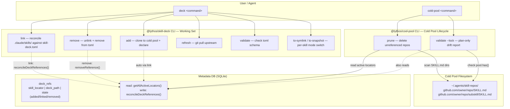
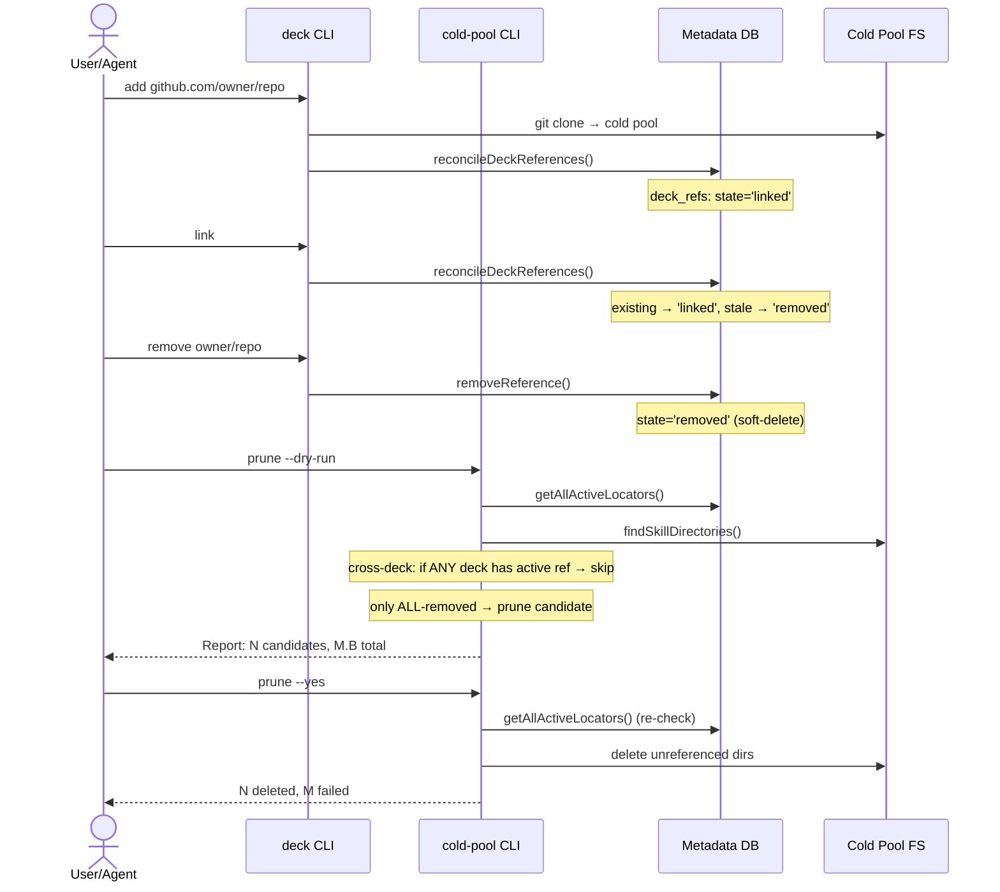
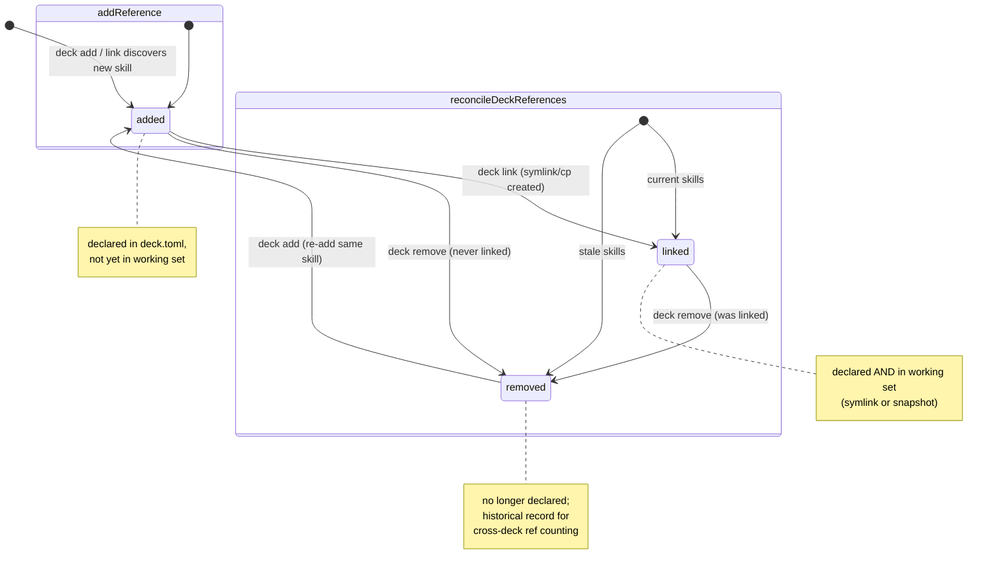
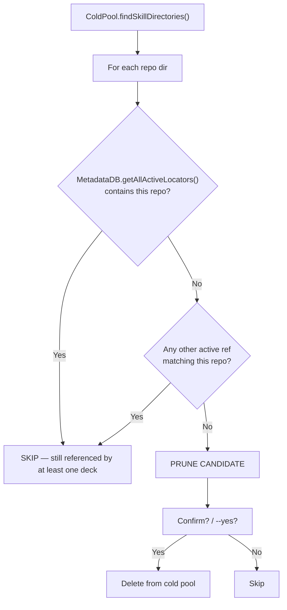

# Cold Pool Architecture — Deck Decoupling with FSM Reference Counting

> Pattern: intent/plan/execute layer separation for skill repository management.

## Background

Originally, `@lythos/skill-deck` (deck CLI) managed the cold pool directly—it scanned
filesystem, computed what to delete, and orchestrated reconciliation. This created three
problems:

1. **Naming collisions**: `deck sync` was a synonym of `deck link`, and `deck reconcile`
   sounded like auto-fix—triggering agent batch-replace reflexes.
2. **Wrong layer**: cold pool operations (prune/reconcile) needed cross-deck reference
   data owned by `@lythos/cold-pool`'s metadata DB, not by `deck`.
3. **One-deck blind spot**: `deck prune` checked a single `skill-deck.toml` against the
   cold pool, ignoring that other decks might reference the same repos.

## Layer Architecture



### Command Flow: deck add → cold-pool prune



### FSM State Machine



### Prune Decision Logic



### Responsibility split

| CLI | Commands | Data source |
|-----|----------|-------------|
| `deck` | `link` `add` `remove` `refresh` `validate` `to-symlink` `to-snapshot` | `skill-deck.toml` + lock file |
| `cold-pool` | `prune` `validate --lock` | metadata DB |

## FSM Reference Counting

`deck_refs` table tracks every skill-deck relationship with a state machine:

```
added ── (deck link) ──→ linked ── (deck remove) ──→ removed
  ↑                                                         │
  └───────────────── (re-add via deck add) ──────────────────┘
```

| State | Meaning | Prunable? |
|-------|---------|-----------|
| `added` | Declared in deck.toml, not yet linked | No |
| `linked` | Declared AND in working set | No |
| `removed` | Was declared, no longer in any deck | Yes (if ALL) |
| `NULL` | Legacy row (pre-FSM) — treated as active | No |

**A repo is prunable only if ALL its refs across ALL decks have state `removed`**
(or no refs exist). The `getAllActiveLocators()` method returns locators with any
non-removed ref—this is the authoritative "don't touch" list.

## SKILL.md Is the Authoritative Marker

Both `list()` (via `buildListPlan`) and `findSkillDirectories()` use SKILL.md presence
as the primary detection criterion. Terminal-depth heuristics alone miss monorepos,
multi-skill repos, and mixed-depth clones.

Detection patterns:

```
<coldPool>/<host>/<owner>/<repo>/SKILL.md              → canonical
<coldPool>/<host>/<owner>/<repo>/<subpath>/SKILL.md    → multi-skill
<coldPool>/<host>/<name>/SKILL.md                       → legacy depth-2
<coldPool>/<host>/SKILL.md                              → legacy depth-1
```

## Plan-First Execution

Both commands are plan-first (report before act):

**prune**: `findSkillDirectories()` + `getAllActiveLocators()` → candidates →
  confirm → delete. `--dry-run` to preview, `--yes` to skip prompt.

**validate**: read `skill-deck.lock` → `pool.has(locator)` for each → `list()`
  for extras → report. No `--apply`; use `deck add` / `cold-pool prune` to converge.

## Schema Timeline

| Version | Change |
|---------|--------|
| v0 (original) | `deck_refs` with hard DELETE |
| v3 (2026-05-09) | `state TEXT` + `linked_at` + `removed_at` — FSM |
| v6 (2026-05-09) | `mode TEXT DEFAULT 'symlink'` — schema-first placeholder |

## Usage

```bash
# Prune: dry-run first
bunx @lythos/cold-pool prune --dry-run

# Prune: actually delete unreferenced repos
bunx @lythos/cold-pool prune --yes

# Validate: check lock state against cold pool
bunx @lythos/cold-pool validate --lock skill-deck.lock
```

## Related

- ADR-20260509144134332 — sync/freeze → to-symlink/to-snapshot rename
- ADR-20260509155630-DRAFT — mode column tracking (schema v6 placeholder)
- ADR-20260507021957847 — cold pool as dedicated resource holder
- ADR-20260507143241493 — metadata layer SQLite design
- ADR-20260424013849984 — lythoskill anti-corruption layer

---

> **Cold pool family**: 6 related pattern files. See index at [cold-pool-cli-boundary](./2026-05-07-cold-pool-cli-boundary.md) for full cross-reference list.
