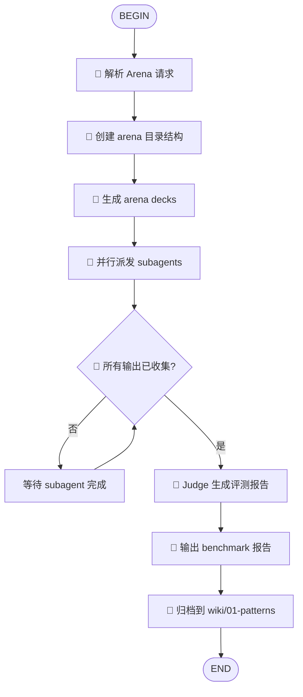

# Skill Arena

> **核心定位：skill / deck 配置的 test play 场**
>
> 不只是对比"哪个单卡更好"，而是对比"哪个 deck 配置在多目标上最优"。
> 支持两种模式：单 skill 对比（控制变量）和 完整 deck 配置对比（Pareto 前沿分析）。

## 流程总览

> 🤖 = 脚本自动化（arena-cli.ts） | 🧠 = Agent 推理（subagent / judge）



**Arena 的核心设计**：脚本只负责**脚手架**（创建目录、生成 deck 文件、写 metadata），真正的**评测推理**在 agent 端完成。Judge 不是脚本，而是一个遵循 TASK-arena.md 指令的 agent。

## 前置条件

1. **Cold Pool 已就绪**：被测 skill 必须在 `~/.agents/skill-repos/` 或 `skills/` 中可用
2. **lythoskill-deck 已安装**：`bunx @lythos/skill-deck link --deck <path>` 可执行
3. **项目已启用 project-cortex**（可选）：arena 报告可写入 `wiki/01-patterns/`

## 执行步骤

### 1. 解析 Arena 请求

从用户输入中提取：
- `task_description`: 要对比的任务描述
- `participants`: 参与竞技的 skill/配置列表
- `evaluation_criteria`: 评测维度（默认：syntax, context, logic, token）
- `control`: 控制变量 skill（默认：project-scribe）

### 2. 创建 Arena 目录结构

```
tmp/arena-<timestamp>-<slug>/
├── arena.json              # metadata + config
├── decks/
│   ├── arena-run-01.toml
│   ├── arena-run-02.toml
│   └── ...
├── runs/
│   ├── run-01.md           # Subagent A 输出
│   ├── run-02.md
│   └── ...
└── TASK-arena.md           # Task Card（subagent 指令）
```

### 3. 生成 Arena Decks

每个 deck 遵循 **控制变量原则**：
- 变量：1 个被测 skill
- 控制变量：统一的辅助 skill

```toml
# decks/arena-run-01.toml
[deck]
max_cards = 10

[tool]
skills = [
  "design-doc-mermaid",     # 被测 skill
  "project-scribe",         # 控制变量
]
```

### 4. 派发 Subagents

对每个 deck 并行启动 subagent：

```bash
# 切换 deck
bunx @lythos/skill-deck link --deck tmp/arena-xxx/decks/arena-run-01.toml

# 执行统一 task prompt，输出到 runs/run-01.md
```

### 5. 收集输出

检查 `runs/run-*.md` 是否全部存在且非空。

### 6. Judge 评测（Agent 推理，非脚本）

**Judge 不是自动化脚本**，而是一个遵循 TASK-arena.md 指令的 agent/subagent。它：

1. 读取所有 `runs/run-*.md`
2. 按 `evaluation_criteria` 逐项对比
3. 给出 1-5 分评分 + 文字评述
4. 输出 `report.md`

为什么不用脚本评分？因为 skill 对比的维度（context 契合度、创新性、可维护性）需要语义理解，无法被规则化。脚本能数 token，但判断"哪个输出更贴合业务场景"需要 agent 推理。

### 7. 归档

若报告质量高，复制摘要到 `wiki/01-patterns/skill-arena-<domain>.md`。

## 命令行工具

### 模式一：单 Skill 对比（控制变量）

```bash
bunx @lythos/skill-arena \
  --task "生成用户认证流程图" \
  --skills "design-doc-mermaid,mermaid-tools" \
  --criteria "syntax,context,token"
```

### 模式二：完整 Deck 配置对比（Pareto 前沿分析）

```bash
bunx @lythos/skill-arena \
  --task "生成用户认证流程图" \
  --decks "./decks/v1-minimal.toml,./decks/v2-rich.toml,./decks/v3-superpowers.toml" \
  --criteria "quality,token,maintainability"
```

**模式二的 Judge 不选 Winner**，而是输出：
1. 每个 deck 的评分向量（各维度 1-5 分）
2. Pareto 非支配解集（没有"最强"，只有不同维度上的最优权衡）
3. 被支配解的劣势分析（被谁在哪个维度上支配）
4. 涌现 combo 标注（如果有 1+1>2 的协同效应）

参数：
- `--task, -t`: 对比任务描述（必填）
- `--skills, -s`: 逗号分隔的被测 skill 列表（模式一，至少 2 个）
- `--decks`: 逗号分隔的 deck toml 路径列表（模式二，至少 2 个）
- `--criteria, -c`: 逗号分隔的评测维度（默认 syntax,context,logic,token）
- `--control`: 控制变量 skill（模式一默认 project-scribe；模式二不使用）
- `--dir, -d`: arena 目录父路径（默认 tmp）
- `--project, -p`: 项目根目录（默认 .）

**--skills 和 --decks 互斥，必须且只能提供其一。**

## 约束

- **max_participants = 5**：一次 arena 最多 5 个 skill/deck
- **必须恢复父 deck**：每个 subagent 完成后必须执行 `bunx @lythos/skill-deck link --deck ./skill-deck.toml`
- **deny-by-default**：未进入 arena deck 的 skill 对 subagent 完全不可见

## 持续 Skill 监控流水线（高级用法）

Arena 不只是"手动对比两个 skill"的工具。它是**持续 skill 监控自动化流水线**的核心评测环节。

### 为什么需要持续监控？

Skill 生态在爆发增长——2025-2026 年每天都有新 skills 发布（GitHub trending、awesome-agent-skills、Vercel marketplace）。手动跟踪和评测是不可能的。

**自动化流水线：**

```
订阅源（RSS / 爬虫 / awesome-list）
        ↓
   发现新 skill（curator / web-search）
        ↓
   自动下载到冷池（git clone）
        ↓
   curator 扫描识别"同类 skill"
        ↓
   arena 自动 A/B 测试（新 skill vs 已有同类）
        ↓
   agent Judge 生成 report.md
        ↓
   viz 可视化对比报告
        ↓
   scribe 记录测评历史（HANDOFF.md）
        ↓
   cortex ADR 记录选型决策
        ↓
   人类终审（5分钟看报告决定 yes/no）
        ↓
   更新 skill-deck.toml + deck link
```

**每个组件的职责：**

| 组件 | 流水线上的角色 |
|------|--------------|
| **web-search / RSS 订阅** | 发现新发布的 skills |
| **curator** | 扫描冷池，识别"这个新 skill 和已有哪些 skill 功能重叠" |
| **deck** | 为 arena 生成控制变量 deck |
| **arena** | **评测核心**：新 skill vs 已有同类，控制变量对比 |
| **viz** | 渲染 agent 的评分结果，生成可视化报告 |
| **scribe** | 记录测评历史，形成累积知识（"我们测过什么、结论是什么"） |
| **cortex** | ADR 记录正式选型决策 |

### 个人/Team 技能测评博客

arena 报告可以发布到你的个人 site，形成**公开的 skill 评测数据库**：

- "Deep Research Skill 对比：Weizhena vs OpenClaw"
- "PDF 解读 Skill 横评：3 个工具处理同一篇 arxiv 论文"
- "Web Search Skill 进化追踪：v1.2 vs v2.0"

这是**使用者视角**的测评——不是 skill 作者的自夸，而是真实使用后的数据说话。

## 设计原则

### 控制变量（Deck Isolation）

> 输出差异必须收敛到**唯一变量**（被测 skill）。

除被测 skill 外，所有 deck 必须完全一致：相同的 prompt、context、judge persona、辅助 skill。

### Agent 评分，非脚本评分

> **千万不要重复 curator `--recommend` 的教训。**

Arena CLI 脚本**不做打分**。脚本只负责：创建目录、生成 deck、收集输出。真正的评分是 **agent (LLM)** 的工作——Judge 读取 runs/ 输出，按 TASK-arena.md 中的 evaluation_criteria 做 LLM 推理评分。

CLI 做结构，agent 做推理，viz 做渲染。三层分离。

### Human Review over Agent Judge

> Agent Judge 提供可复现的**初筛**，人类提供 agent 无法复制的**终审**。

所有 arena 产物持久化在文件系统中，默认**等待人类复核**。

**Agent Judge 的局限**：只能基于 prompt 中定义的 criteria 评分；无法感知组织战略、政治约束；可能过度偏好结构化输出。

**人类终审可以发现**：Context 误判、价值观冲突、新颖性盲区。

## Test Play 心智模型：卡牌游戏

arena 的操作模型完全映射卡牌游戏的 test play：

| 卡牌游戏 | Arena 对应 | 当前支持 |
|---------|-----------|---------|
| **选卡**：A 和 B 哪个更好？ | `--skills "A,B"` 单卡对比 | 是 |
| **加卡**：现有 28 卡组 + 新卡 C？ | `--decks "v1.toml,v1+C.toml"` 完整 deck 对比 | 是 |
| **去卡**：去掉卡 D 会不会更好？ | `--decks "v1.toml,v1-D.toml"` | 是 |
| **换卡**：用 E 替换 F？ | `--decks "v1.toml,v1-E+F.toml"` | 是 |
| **卡组对决**：lythos deck vs superpowers deck | `--decks "lythos.toml,superpowers.toml"` | 是 |

**关键区别**：单卡对比回答"哪张卡更好"，完整 deck 对比回答"在特定卡组上下文中，加/去/换卡的边际效果如何"。后者才是卡牌玩家真正做的事。

## Pareto 前沿：没有"最强"，只有"最优权衡"

单目标评测（选一个 Winner）把多维度压缩成一个标量。这在 skill 生态中是不合理的：

- 一个 token 效率极高但质量中等的 deck
- 一个质量极高但 token 昂贵的 deck

两者可能都在 Pareto 前沿上——取决于你最在意什么。

**Arena 的 MOO（多目标优化）评测**：

```
                token 效率 ↑
                    │
                    │    ★ Deck C (高质量, 中等 token)
                    │         ← Pareto 前沿
                    │  ★ Deck B (中等质量, 低 token)
                    │
                    │              ★ Deck A (高质量, 高 token)
                    │                   ← 被 C 支配（同质量但更贵）
                    └──────────────────────── 输出质量 →
```

Judge 的任务不是选 Winner，而是：
1. 输出每个 deck 的**评分向量**
2. 识别**Pareto 非支配解集**
3. 标注**被支配解**的劣势
4. 发现**涌现 combo**（多个 skill 组合产生 1+1>2）
