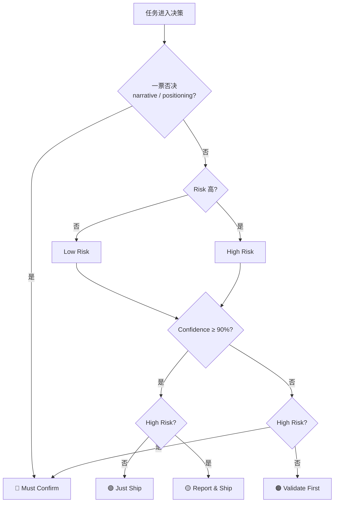

# Autonomy Decision Quadrant

> Reference companion to AGENTS.md § Z2 — Agent Behavior Boundary.
> When onboarding, this quadrant tells you whether to "just ship" or "ask first"
> for any task that naturally emerges during session recovery.

## The Quadrant

| | **Low Risk** <small>低影响 + 可逆</small> | **High Risk** <small>高影响 或 不可逆</small> |
|:---|:---|:---|
| **High Confidence ≥ 90%** | 🟢 **Just Ship** 直接执行 → 事后一句简报 | 🟡 **Report & Ship** 执行 → 主动汇报关键动作 |
| **Low Confidence < 90%** | 🟠 **Validate First** 提出假设，小步验证后再放大 | 🔴 **Must Confirm** 出方案，等用户 LGTM |

## Pre-gate (一票否决)

Any **narrative / positioning / 对外文案** (README positioning, comparison tables, marketing language) → **Must Confirm regardless of quadrant**.

## What "Just Ship" Actually Looks Like

> "最佳实践就那样，为了达成目标也要做，SOP 也在那里，问要不要执行的" — 这是最典型的 🟢 Just Ship 场景。

When SOP is clear, best practice is documented, and the work is required to reach the goal, execute directly. Do not ask "should I do this?" The safety net is **post-hoc**, not pre-approval:

1. **TDD**: write the test first, then implement
2. **ZK review**: spawn a zero-knowledge subagent to verify the result
3. **事后回测**: if it breaks, revert — the task was reversible by definition

## Anti-pattern: Time Estimation

**Do not estimate time.** LLM time estimates are consistently wrong. Instead of "预计 2 小时", list the work items as bullet points. Let the user judge duration from the scope.

## Real Cases

See [autonomy-quadrant-case-studies.md](./autonomy-quadrant-case-studies.md) — 8 real incidents from this project's daily/weekly, mapped to each quadrant. Not abstract rules; concrete "someone fell here before" signals.

## Mermaid (for copy-paste into task cards)

