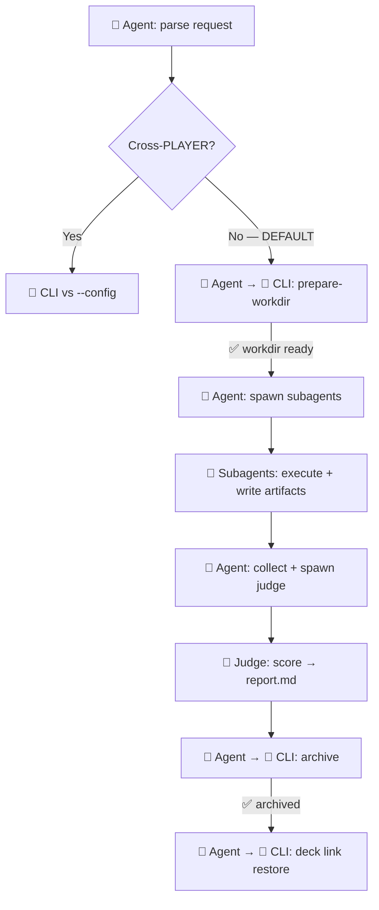

# Skill Arena
> Test play for skills and deck configurations. Not "which is best" — "which is best for what."

## Decision Tree (READ FIRST)

```
User says: "test/compare/arena/benchmark/A vs B"
    │
    ├── Cross-PLAYER? (kimi vs codex vs claude)
    │   OR user explicitly says useAgent/specific player
    │   OR platform doesn't support Agent tool subagents
    │     → CLI runner REQUIRED (useAgent → Bun.spawn)
    │     → bunx @lythos/skill-arena vs --config arena.toml
    │     → Each side spawns its player CLI process
    │
    └── Same player, different DECKS? (DEFAULT)
          → Agent-orchestrated — NO CLI
          → YOU spawn subagents via Agent tool
          → CLI prepare-workdir + CLI archive + parallel dispatch
          → Judge subagent collects + scores
```

## Default: Agent-Orchestrated (single & cross-deck vs)

**This is how arena works 95% of the time.** The agent and CLI operate as a two-way control transfer protocol. Agent delegates mechanical invariants to CLI. CLI hands control back via its exit paths (success → next step; error → fix command). Agent stays in its own main loop — the subagent pattern is container spawn, not external RPC.



**The protocol in one line**: Agent hands to CLI (`prepare-workdir`, `archive`, `deck link`). CLI exits with success (`✅ workdir ready → spawn`) or HATEOAS error (`❌ missing --deck → here's the fix command → retry`). Agent reads the exit, decides next move, continues. Three CLI exit points, three handoffs back to agent.

### single — test one deck

```
🤖→🔧 prepare-workdir --out /tmp/arena-xxx --brief "task"
    CLI exits: ✅ Workdir ready → 🤖 spawn subagent
🤖 Agent tool spawn: subagent executes in workdir, writes artifacts + decision-log.jsonl
🤖→🔧 archive --from /tmp/arena-xxx --to ./playground --sides side-a
    CLI exits: ✅ Archive complete → 🤖 done
🤖→🔧 deck link parent deck (restore)
```

### cross-deck vs — compare decks A vs B

```
🤖→🔧 prepare-workdir × N (each side isolated, each with own deck)
    CLI exits: ✅ Workdir ready × N → 🤖 spawn N subagents in parallel
🤖 Agent tool spawn ×N, run_in_background=true
🤖 Collect artifacts + decision-logs from all sides
🤖 Spawn judge subagent: score per criteria → report.md
🤖→🔧 archive --from /tmp/arena-xxx --to ./playground --sides side-a,side-b
🤖→🔧 deck link parent deck (restore)
```

**Why agent-orchestrated is default**: Subagent = container spawn, not external RPC. Agent stays in its own main loop — can read subagent output, fix failures mid-run (switch mirror, adjust timeout, retry), spawn judge. Decision-log.jsonl from each subagent provides full observability. Cross-deck vs IS map-reduce — same agent type, different decks, parallel spawn, judge reduce.

## Cross-Player Mode (OPT-IN, CLI only)

Use ONLY when comparing different players (kimi vs codex vs deepseek vs claude). The Agent tool can only spawn the same agent type — it CANNOT simulate another CLI's memory, hooks, or tool-use semantics. This is a hard runtime boundary, not a preference.

```bash
# Single deck, explicit player
bunx @lythos/skill-arena@0.17.0 single \
  --deck ./skill-deck.toml \
  --brief "Investigate this repo" \
  --player kimi

# vs mode with arena.toml (each side's player in config)
bunx @lythos/skill-arena@0.17.0 vs --config ./arena.toml
```

See `references/player-setup.md` for player discovery, installation, and API key setup.

## Standard Posture: Arena as Mindset Validator

**Purpose**: Verify that a skill's **mental model** (SOP, behavior pattern, decision chain) actually shapes agent behavior — not just that the skill file is read.

**Minimal deck principle**: Include ONLY the governance skill (`lythoskill-deck`) and the target skill under test. Extra skills dilute the signal — you are testing whether the target skill's intent survives when no other skills are there to compensate.

**Standard posture** (4 steps):

1. **Prepare** — `prepare-workdir` with minimal deck
   ```bash
   bunx @lythos/skill-arena@0.17.0 prepare-workdir \
     --deck ./test-deck.toml \
     --out /tmp/arena-$(date +%Y%m%d-%H%M%S) \
     --brief "Execute the target skill's core workflow"
   ```

2. **Dispatch** — spawn subagent with decision-log mandate
   - Prompt MUST include: "Your working directory is {workDir}. Deck: {deckPath}. Task: {brief}. MANDATORY: write decision-log.jsonl to your CWD. Each line records a decision you made and why."

3. **Observe** — collect decision-log, not just artifacts
   - Read `decision-log.jsonl` from workdir
   - Check: did the subagent follow the skill's declared SOP?
   - Check: did the subagent stop at decision points and ask, or did it guess?
   - Check: are the decisions traceable to the skill's instructions?

4. **Judge** — score mindset alignment, not output correctness
   - "Did the subagent behave as the skill intended?" > "Was the output correct?"
   - A correct output achieved by guessing is a FAIL — the skill's mental model did not transfer.
   - A wrong output achieved by faithfully following the skill's SOP is valuable feedback — the skill's instructions need refinement.

**Why this matters**: A skill that declares "MUST FILL" but agents consistently leave empty has a **mindset gap** — the skill's intent is stated but not enforced by the agent's decision chain. Arena catches this before the skill reaches users.

## Agent-Orchestrated Protocol

### 1. Setup — isolate per side

For EACH side, use `prepare-workdir` (same behavior as CLI `single` mode):

```bash
# Plan-first: review before executing
bunx @lythos/skill-arena@0.17.0 prepare-workdir \
  --deck ./side-a.toml \
  --out /tmp/arena-$(date +%Y%m%d-%H%M%S)-side-a \
  --brief "task description" \
  --dry-run

# Execute (same command minus --dry-run)
bunx @lythos/skill-arena@0.17.0 prepare-workdir \
  --deck ./side-a.toml \
  --out /tmp/arena-$(date +%Y%m%d-%H%M%S)-side-a \
  --brief "task description"
```

> `/tmp` is the experiment sandbox. Never run experiments in committed directories.
> Plan-first (`--dry-run`) shows skills, workdir path, link needed — review before IO.

### 2. Preflight self-check (BEFORE dispatch)

```bash
pwd && ls .claude/skills/ 2>/dev/null || ls .agents/skills/ 2>/dev/null && touch .arena-write-test && rm .arena-write-test && echo "OK"
```

If ANY fail → fix before proceeding.

### 3. Dispatch — parallel spawn

One subagent per side:

```
subagent prompt:
  "You are an arena cell. Your working directory: {workDir}.
   Deck: {deckPath}.
   Task: {brief}
   MANDATORY: write decision-log.jsonl to your CWD.
   Each line: {"t":<seconds>,"phase":"...","decision":"...","reason":"..."}"
```

All subagents run in PARALLEL. Each writes to its own isolated workdir. No file conflicts.

> **Platform note**: `run_in_background` (or your platform's async spawn equivalent) keeps parent unblocked. Subagent inherits parent CWD — include `"Your working directory is {workDir}"` in the prompt so it cd's to the right place. Subagent skills load from the working set directory in that workdir (default `.claude/skills/`).

### 4. Collect + Judge + Report + Archive

After ALL complete:

**1. Collect**
- Gather artifacts + `decision-log.jsonl` from each side's workdir

**2. Judge**
- Spawn judge subagent with all artifacts as context
- Score per criteria → write `report.md`

**3. Archive (same behavior as CLI `--out`)**

Use `archive` command (same copy logic as CLI `single` mode). Plan-first: dry-run to review what will be copied, then execute.

```bash
# Plan-first
bunx @lythos/skill-arena@0.17.0 archive \
  --from /tmp/arena-$(date +%Y%m%d-%H%M%S) \
  --to playground/arena-$(date +%Y%m%d-%H%M%S) \
  --sides side-a,side-b \
  --report ./report.md \
  --dry-run

# Execute (same minus --dry-run)
bunx @lythos/skill-arena@0.17.0 archive \
  --from /tmp/arena-$(date +%Y%m%d-%H%M%S) \
  --to playground/arena-$(date +%Y%m%d-%H%M%S) \
  --sides side-a,side-b \
  --report ./report.md
```

**Archive contract** (same skipSet as CLI `--out`: skips `.claude`, `skill-deck.toml`, `skill-deck.lock`, `AGENTS.md`) (same as CLI default):
| File | Required | Purpose |
|------|----------|---------|
| `report.md` | YES | Comparative analysis + verdict |
| `README.md` | YES | Deck configs, task brief, run metadata |
| `{side}/decision-log.jsonl` | YES | Agent reasoning per side |
| `{side}/artifacts/*` | YES | HTML, docx, pdf, etc. |
| `reproduce.sh` | NO | Shell script recording `prepare-workdir` + `archive` commands (agent spawn is manual, CLI commands are reproducible) |

**4. Restore**
- `deck link --deck ./skill-deck.toml`

## Reference passing (don't inline large context)

If task context is large (cortex cards, research notes), pass file REFERENCES, not inline text:

```
TASK: Review the API design.
Read: docs/adr/ADR-xxx.md, docs/patterns/xxx.md
Then implement in src/.
```

Subagent has the same Read capability — shorter prompt, lower cost, can re-read. Use inlining only for small, self-contained tasks.

## CLI Quick Reference

```bash
# single — most common
bunx @lythos/skill-arena@0.17.0 single \
  --deck ./deck.toml --brief "task" --out ./output

# vs — declarative config
bunx @lythos/skill-arena@0.17.0 vs --config ./arena.toml

# Parameters
# --brief "<prompt>"    Inline task (primary input for single)
# --deck <path|url>     Deck for single subagent (URL auto-fetched)
# --player <name>       Only for cross-player: kimi|codex|deepseek|claude
# --timeout <ms>        Complex tasks need 300000-600000
# --out <dir>           All artifacts copy here after run
# --config <path>       arena.toml for vs mode
# --dry-run             Print execution plan without running
```

## Constraints

- max 5 sides per arena run
- RESTORE parent deck after every run: `deck link --deck ./skill-deck.toml`
- deny-by-default: skills not in the arena deck are invisible to subagents

## Gotchas

**CLI scaffolds, agent executes**: The CLI only creates directories + deck files. It does NOT dispatch subagents or score outputs.

**Agent tool CANNOT cross-player**: Only `Bun.spawn` can call different CLI binaries. Agent tool spawn is same-agent only.

**Judge is not a script**: Semantic comparison ("which better fits the scenario") requires LLM inference. Token counting is scriptable; judgment is not.

**vs does not pick a winner**: Pareto frontier analysis — a cheap-medium-quality deck and expensive-high-quality deck can both be non-dominated.

**Subagent spawn parameters** (Claude Code baseline — adapt to your platform):

| Parameter | What it does | What it does NOT do |
|-----------|-------------|---------------------|
| `run_in_background` | Async spawn. Parent continues. Completion triggers notification. | Does NOT change subagent CWD. Must set via prompt. |
| `prompt` | Initial instructions to subagent. | Does NOT auto-load skills. Skills load from subagent's actual workdir. |
| `subagent_type` | Which agent implementation (claude, general-purpose, etc.) handles the task. | Does NOT set cross-player mode. Cross-player requires CLI runner with `--player`. |

## Supporting References

| When you need to… | Read |
|--------------------|------|
| Set up players, API keys, discovery | [references/player-setup.md](./references/player-setup.md) |
| Look up arena.toml or player config schema | [references/configuration-schemas.md](./references/configuration-schemas.md) |
| Understand Pareto frontier scoring | [references/pareto-analysis.md](./references/pareto-analysis.md) |
| Map arena operations to card game test play | [references/test-play-model.md](./references/test-play-model.md) |
| Detect deck synergy and combos | [references/combo-and-synergy.md](./references/combo-and-synergy.md) |
| Set up continuous monitoring | [references/continuous-monitoring.md](./references/continuous-monitoring.md) |
| Let agent self-initiate arena runs | [references/agent-autonomous-arena.md](./references/agent-autonomous-arena.md) |
| Review design principles | [references/design-principles.md](./references/design-principles.md) |
| Write or run reproduce.sh BDD scenarios | [references/reproduce-sh-bdd-contract.md](./references/reproduce-sh-bdd-contract.md) |
