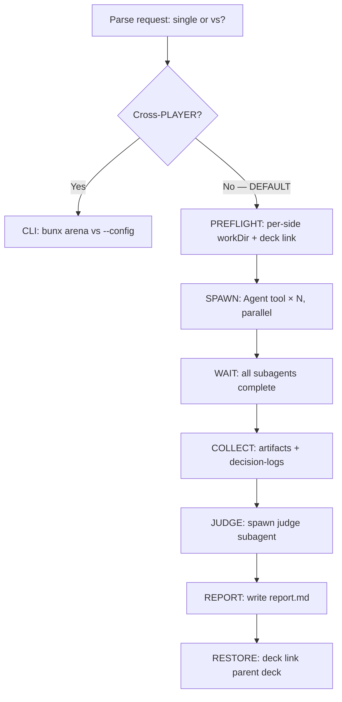

# Skill Arena
> Test play for skills and deck configurations. Not "which is best" — "which is best for what."

## Decision Tree (READ FIRST)

```
User says: "test/compare/arena/benchmark/A vs B"
    │
    ├── Different PLAYERS? (kimi vs codex vs claude)
    │     → CLI runner REQUIRED
    │     → bunx @lythos/skill-arena vs --config arena.toml
    │     → Each side spawns its player CLI process
    │
    └── Same player, different DECKS? (DEFAULT)
          → Agent-orchestrated — NO CLI
          → YOU spawn subagents via Agent tool
          → Isolated workdirs + per-deck link + parallel dispatch
          → Judge subagent collects + scores
```

## Default: Agent-Orchestrated (single & cross-deck vs)

**This is how arena works 95% of the time.** The agent reads config, preps isolated environments, spawns parallel subagents, judges — zero CLI invocations.



### single — test one deck

```
User: "test this skill" / "try this deck" / "run arena single"
  → Create isolated workdir
  → deck link the target deck
  → Agent tool spawn ×1: execute task
  → Collect artifacts → DONE
```

### cross-deck vs — compare decks A vs B

```
User: "compare deck A vs B" / "which deck is better"
  → Create N isolated workdirs
  → Each with its own deck link (different skill-deck.toml)
  → Agent tool spawn ×N, run_in_background=true
  → All run in PARALLEL — independent CWDs, independent decks
  → Collect artifacts from all sides
  → Spawn judge subagent: score per criteria
  → Write report.md
```

**Why agent-orchestrated is default**: CWD isolation prevents skill pollution. Agent can fix failures mid-run (switch mirror, adjust timeout, retry). Decision-log.jsonl from each subagent provides full observability. Cross-deck vs IS map-reduce — same agent type, different decks, parallel spawn, judge reduce.

## Cross-Player Mode (OPT-IN, CLI only)

Use ONLY when comparing different players (kimi vs codex vs deepseek vs claude). The Agent tool can only spawn the same agent type — it CANNOT simulate another CLI's memory, hooks, or tool-use semantics. This is a hard runtime boundary, not a preference.

```bash
# Single deck, explicit player
bunx @lythos/skill-arena@0.13.3 single \
  --deck ./skill-deck.toml \
  --brief "Investigate this repo" \
  --player kimi

# vs mode with arena.toml (each side's player in config)
bunx @lythos/skill-arena@0.13.3 vs --config ./arena.toml
```

See `references/player-setup.md` for player discovery, installation, and API key setup.

## Agent-Orchestrated Protocol

### 1. Setup — isolate per side

For EACH side, create an isolated workdir in `/tmp/` (never in project root or any committed directory):

```bash
mkdir -p /tmp/arena-{timestamp}/work/{side}/
cd /tmp/arena-{timestamp}/work/{side}
# Write skill-deck.toml with this side's skills
bunx @lythos/skill-deck@latest link --deck skill-deck.toml --cold-pool ~/.agents/skill-repos
```

> **Sandbox discipline**: `/tmp` is the experiment sandbox. Copy outputs to your project's artifact directory (e.g. `--out ./output/` or a docs/showcase dir) after the run. Never run experiments in committed directories.

### 2. Preflight self-check (BEFORE dispatch)

```bash
pwd && ls .claude/skills/ && touch .arena-write-test && rm .arena-write-test && echo "OK"
```

If ANY fail → fix before proceeding.

### 3. Dispatch — parallel spawn

One subagent per side:

```
subagent prompt:
  "You are an arena cell. Your working directory: {workDir}.
   Deck: {deckPath}.
   Task: {brief}
   MANDATORY: write decision-log.jsonl to your CWD.
   Each line: {"t":<seconds>,"phase":"...","decision":"...","reason":"..."}"
```

All subagents run in PARALLEL. Each writes to its own isolated workdir. No file conflicts.

> **Platform note**: `run_in_background` (or your platform's async spawn equivalent) keeps parent unblocked. Subagent inherits parent CWD — include `"Your working directory is {workDir}"` in the prompt so it cd's to the right place. Subagent skills load from `.claude/skills/` in that workdir.

### 4. Collect + Judge + Report

After ALL complete:
- Collect artifacts + decision-log.jsonl per side
- Spawn judge subagent with all artifacts as context
- Judge scores per criteria → write `report.md`
- RESTORE parent deck: `deck link --deck ./skill-deck.toml`

## Reference passing (don't inline large context)

If task context is large (cortex cards, research notes), pass file REFERENCES, not inline text:

```
TASK: Review the API design.
Read: docs/adr/ADR-xxx.md, docs/patterns/xxx.md
Then implement in src/.
```

Subagent has the same Read capability — shorter prompt, lower cost, can re-read. Use inlining only for small, self-contained tasks.

## CLI Quick Reference

```bash
# single — most common
bunx @lythos/skill-arena@0.13.3 single \
  --deck ./deck.toml --brief "task" --out ./output

# vs — declarative config
bunx @lythos/skill-arena@0.13.3 vs --config ./arena.toml

# Parameters
# --brief "<prompt>"    Inline task (primary input for single)
# --deck <path|url>     Deck for single subagent (URL auto-fetched)
# --player <name>       Only for cross-player: kimi|codex|deepseek|claude
# --timeout <ms>        Complex tasks need 300000-600000
# --out <dir>           All artifacts copy here after run
# --config <path>       arena.toml for vs mode
# --dry-run             Print execution plan without running
```

## Constraints

- max 5 sides per arena run
- RESTORE parent deck after every run: `deck link --deck ./skill-deck.toml`
- deny-by-default: skills not in the arena deck are invisible to subagents

## Gotchas

**CLI scaffolds, agent executes**: The CLI only creates directories + deck files. It does NOT dispatch subagents or score outputs.

**Agent tool CANNOT cross-player**: Only `Bun.spawn` can call different CLI binaries. Agent tool spawn is same-agent only.

**Judge is not a script**: Semantic comparison ("which better fits the scenario") requires LLM inference. Token counting is scriptable; judgment is not.

**vs does not pick a winner**: Pareto frontier analysis — a cheap-medium-quality deck and expensive-high-quality deck can both be non-dominated.

**Subagent spawn parameters** (Claude Code baseline — adapt to your platform):

| Parameter | What it does | What it does NOT do |
|-----------|-------------|---------------------|
| `run_in_background` | Async spawn. Parent continues. Completion triggers notification. | Does NOT change subagent CWD. Must set via prompt. |
| `prompt` | Initial instructions to subagent. | Does NOT auto-load skills. Skills load from subagent's actual workdir. |
| `subagent_type` | Which agent impl handles the task. | Does NOT control model (Claude vs Kimi). Model is host config. |

## Supporting References

| When you need to… | Read |
|--------------------|------|
| Set up players, API keys, discovery | [references/player-setup.md](./references/player-setup.md) |
| Look up arena.toml or player config schema | [references/configuration-schemas.md](./references/configuration-schemas.md) |
| Understand Pareto frontier scoring | [references/pareto-analysis.md](./references/pareto-analysis.md) |
| Map arena operations to card game test play | [references/test-play-model.md](./references/test-play-model.md) |
| Detect deck synergy and combos | [references/combo-and-synergy.md](./references/combo-and-synergy.md) |
| Set up continuous monitoring | [references/continuous-monitoring.md](./references/continuous-monitoring.md) |
| Let agent self-initiate arena runs | [references/agent-autonomous-arena.md](./references/agent-autonomous-arena.md) |
| Review design principles | [references/design-principles.md](./references/design-principles.md) |
